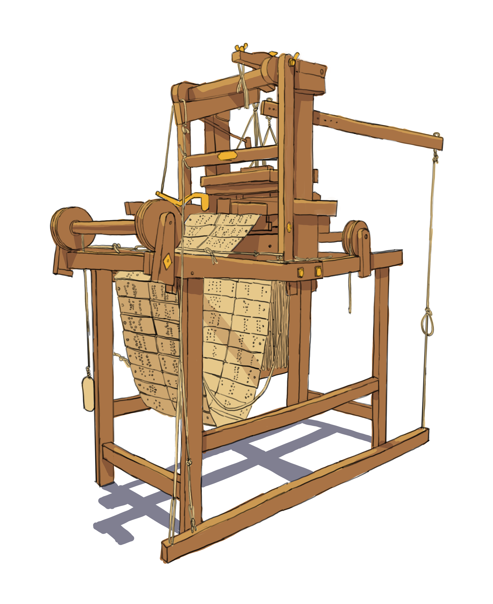
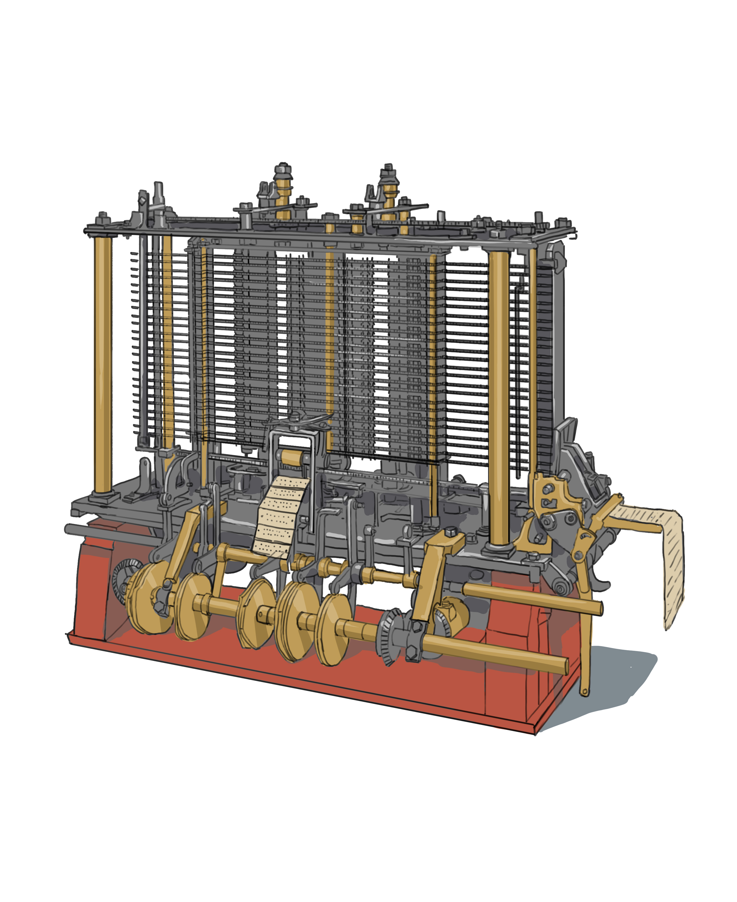
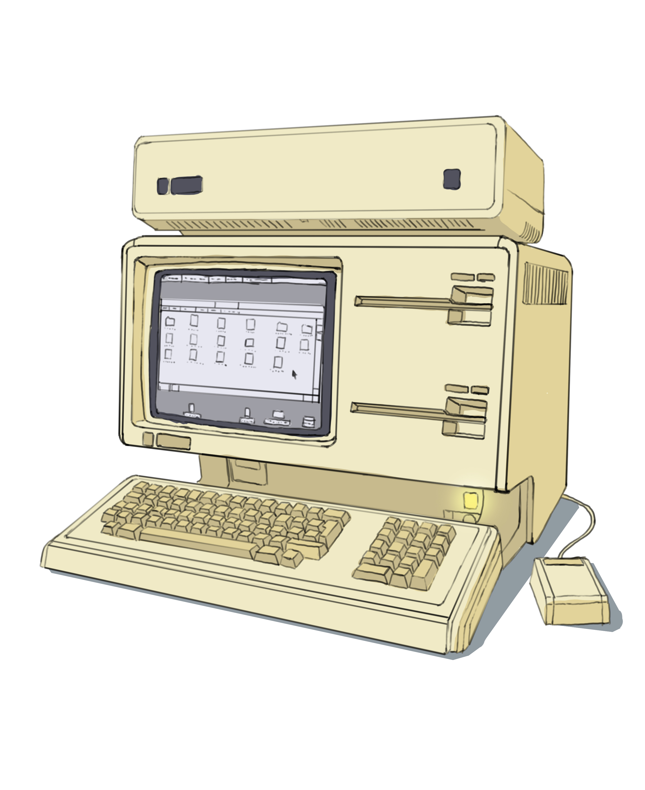

Is your smartphone considered a computer? How about the components inside your oven that allow you to connect to it via an app? What are the minimum requirements for something to be considered a computer? That's what we'll explore in this article.

## Table of Contents

[A Brief History of Computing](#a-brief-history-of-computing)

- [The Jacquard Loom: Breakthrough in Automation](#the-jacquard-loom-breakthrough-in-automation)
- [Charles Babbage and the Analytical Engine: Conceptualizing the Computer](#charles-babbage-and-the-analytical-engine-conceptualizing-the-computer)
- [Electronic Computing: WWII's Technological Impact](#electronic-computing-wwiis-technological-impact)
- [Computer Terminals: An Advancement in Human-Computer Interaction](#computer-terminals-an-advancement-in-human-computer-interaction)

[The Modern State of Computers](#the-modern-state-of-computers)

[Computer Fundamentals](#computer-fundamentals)

[Questions](#questions)

## A Brief History of Computing

### The Jacquard Loom: Breakthrough in Automation

Before the year 1805, if I wanted to make a piece of cloth, such as a napkin, with a beautiful design on it, I would have to use a device called a handloom and manually control the position of each thread to create the desired pattern. And if I wanted to make two such napkins, I'd have to redo the entire process.

However, then came the Jacquard loom, named after the French weaver Joseph-Marie Jacquard. This device used a system of stiff paper with holes punched into them in specific patterns, which was a representation of a portion of the actual design pattern. So now, instead of manually controlling the threads with my hands, I would insert a series of these punch cards into the loom, and the machine would lift and lower threads based on the hole positions on the card.

> Watch [this short animation](https://www.youtube.com/watch?v=K6NgMNvK52A) demonstrating this process.

What does this have to do with computers? Well, while the Jacquard loom is not directly related to the development of computers, it started a conversation about input and output, as well as automation and "feeding instructions" to a machine.

*The Jacquard loom has revolutionized the textile industry.*

"Input" is what goes "in" a system, and "output" is what comes "out" as a result. Before the Jacquard loom, direct human intervention was critical in the input to get the desired output. In the case of the Jacquard loom, at a given moment, the input is a punch card, and the output is a row of threads being woven in a specific pattern, all without the "human touch".

This invention laid the foundation for key concepts in computing, notably the idea of feeding punch cards (containing instructions) as input to a machine. It foreshadowed the later development of computing devices.

### Charles Babbage and the Analytical Engine: Conceptualizing the Computer

The first device considered a computer was the Analytical Engine, conceptualized by English inventor Charles Babbage in the 1830s. Although it was never fully constructed during his lifetime, Babbage's designs and ideas laid the foundation for modern computing.

*The Analytical Engine is a groundbreaking early computer design.*

What made this device the first computer? Well, because it had all functionalities of one: there was a reader to accept inputs in the form of punch cards, a printer to output and print the results, a processing unit to perform computations, and a storage unit to store, retrieve, and manipulate data. The Analytical Engine was an early, mechanical version of a general-purpose computer capable of solving various math problems using a steam engine to power the machine and turn all its gears.

> To get an idea of what the Analytical Engine would've looked liked, [watch this video](https://www.youtube.com/watch?v=be1EM3gQkAY).

### Electronic Computing: WWII's Technological Impact

It wasn't until a hundred years after Babbage conceptualized his Analytical Engine that the first physical computer was actually built. We are now in the early 1940s, in the middle of the Second World War, and electricity has played a major role in the development of many new technologies, replacing their mechanical counterparts.

During this time, several pioneering computers were independently designed in Germany (the Z3 in 1941), in the United States (the ABC in 1942), and in the United Kingdom (the Colossus in 1943), representing significant advancements in the field of computing. The large investment into this field was fueled by the desire to develop secure communication and encryption systems, decrypt the enemy's military communications, as well as predict weapon trajectory and analyze data in general. At the root of all of these problems is mathematics, hence making computers important.

As it turned out, doing math using digits 0, 1, 2, ..., 8, 9 was not the most effective way for computers. Instead, the binary representation of numbers was used to perform all the calculations, and most computers today solely use binary numbers.

> Want to read a bit more on binary? Here's a [recommended reading](https://www.mathsisfun.com/binary-number-system.html).

This was not only perfect with the use of punch cards and punch tapes, where the presence of a hole can be represented with a 0, and the absence of a hole can be represented by a 1, but it also worked out well with the next technological advancement: vacuum tubes. These look like little light bulbs, but more importantly they were electronic devices that controlled and manipulated electrical signals, providing the means to process and control data electronically, which in turn enabled their use in mathematical calculations. In this system, a '1' in binary corresponded to a lit bulb, while a '0' represented an unlit bulb. With these binary digits, computers could perform calculations, store data, and execute user instructions.

*An assortment of vacuum tubes.*

> [Take a look at the ENIAC](https://www.youtube.com/watch?v=HgsklKafxG8): considered to be the world's first general-purpose electronic computer, built in 1945.

### Computer Terminals: An Advancement in Human-Computer Interaction

What we have so far are tens of thousands of vacuum tubes and even more small electronic components making up a room-sized computer, known as the mainframe. As the mainframes themselves evolved, there arose a need for better ways for humans to interact with them.

The input/output, or I/O, conversation began in the early 1800s with the Jacquard loom, and has evolved from punch cards, to punch tapes, to teletype machines, and finally, in the 1960s, the terminal which was a display using CRTs, or "cathode-ray tubes".

CRT displays transmitted light onto a screen, and this meant that it could be written and re-written endlessly, as opposed to paper copies. With CRTs, we now had a device, called a terminal, which consisted of a screen and a keyboard, enabling users to input text-based instructions using the keyboard, and receive output from the mainframe computer by looking at the screen. This terminal served as an interface, i.e. a point of interaction, between the user and the mainframe computer.

The terminal screen consisted of a black background, with green or white alphanumeric characters. One reason for the black background was to reduce eye strain; a white background would cause eye fatigue and glare, and it would also require a significant amount of power.

*The VT100 is a Terminal Introduced in 1978. Notice that there is no mouse.*

The invention of computer terminals significantly improved the efficiency and usability of computers. It enabled users to interact with the machines in a more intuitive and direct manner, enabling the growth and adoption of computing technology.

## The Modern State of Computers

Today, we no longer have room-sized mainframes made of vacuum tubes. Nor do we communicate with our computers using text-based commands through a device called a terminal... well actually, some of us still sort of do that. More on this in the next chapter. But it is true that the average person will never need to encounter anything that resembles a terminal. Large corporations such as Microsoft and Apple make their systems very easy to use, so much so that our grandparents can also catch on with the latest tech. On top of a keyboard, we also use a mouse to use visual applications like Microsoft PowerPoint, watch videos on Youtube, save pictures on our computers, and scroll down social media. Imagine having to write a text command to open your web browser. Imagine going on your social media account, and only seeing text.

*Apple Lisa: a GUI pioneer.*

This is hard to imagine because the modern state of computers is characterized by user-friendly interfaces, notably graphical user interfaces (GUIs). Instead of typing complex commands into a terminal, we interact with our computers using intuitive visual elements such as icons, buttons, menus, and windows.

We moved away from vacuum tubes, and now have tiny transistors, billions of them, all tightly packed inside a laptop or smartphone, which we can hold with one hand. We no longer use the terms "mainframe"; the mainframe is now simply the computer or laptop, simply reduced in size considerably. And as for the terminal, the device that used to be separate from the mainframe and used to communicate with it, that is now just the screen and the laptop's keyboard itself. It all got combined into one device, seamlessly.

And while it seems like the computers of today are very different from the "number crunchers" from the 1940s, when the only purpose of computers was to solve lengthy, difficulty, and tedious math problems, you may be surprised to hear that everything a modern computer does essentially boils down to math.

I'll give an example. Say you are using Photoshop, and you want to increase the brightness of an image. As you slide the "brightness" bar, the computer works through all the pixels of the image and changes (using math) the RGB (Red Green Blue) values accordingly.

> Read some more about it [here](https://www.csfieldguide.org.nz/en/chapters/data-representation/images-and-colours/).

## Computer Fundamentals

Watching cat videos on a computer is cool, but what is a computer fundamentally? What makes a given device a "computer"? Because clearly, if our laptops didn't give us access to cat videos, it would still be considered a computer... right?

Well, the word "computer" comes from the verb "to compute", and by adding "er" to the end it means "someone that computes", just like what "writer" is to "to write", "dancer" is to "to dance", and "programmer" is to "to program".

Since the first use of the word in the 1600's, "computers" have evolved. They have gone from a person who computes, to machines that compute. But is computing all that is really required nowadays to be considered a "computer"? For example, take [a "computer" made up of dominoes](https://www.youtube.com/watch?v=w6E7aQnA4Ws). Based on the input, this "computer" computes and outputs the result. Can this system technically be considered a computer? Even though they call it a computer in the video, they are using the looser definition of "computer" as "something that computes". Following a slightly stricter definition of a modern computer, the answer would be "no, this is far from a computer".

Why isn't a domino computer, or even a [water computer](https://www.youtube.com/watch?v=IxXaizglscw), technically a computer? Because in order to be a computer, you have to do more than just perform mathematical computations. That's why a basic calculator isn't a computer.

For one, these systems don't have a way to store data or retrieve previous calculations. They don't provide the possibility to store any data.

Think back to Charles Babbage's Analytical Engine, the first computer ever conceived. What were its components?

1. A device that takes in punch cards (the input),
2. a section that performs calculations based on the inputs (the processing unit),
3. a section that can store numbers (the memory), and
4. a way to show the user the result of the calculations (the output).

This device allowed the operator to input an instruction that says "fetch the number in memory slot '5' and divide it by 10". While the domino calculator does have a way to input, a way to process data, and a way to output the result, it is missing the storage aspect.

Now what about those calculators that can store and display some of the last few calculation results. Or what if we could store numbers using dominoes. Would these be considered computers?

Following the stricter and more modern definition of "computer", these systems would be missing one final ingredient: programmability. This means that the system is not only capable of doing the tasks which it was designed to do, but it could also do other things based on user instructions. In other words, in order to be a computer, a system needs to be capable of not only performing predefined tasks, but also executing user instructions or custom programs.

While both a basic calculator and a laptop are similar in the fact that they both process numbers, calculators do not have the capability to store custom programs written by the user. As for those "programmable calculators", which can in fact do that, well those can be considered computers, albeit simple ones.

The reason why I say that it "can" be a computer, is because there is an even stricter definition of computer as needing to be "general-purpose". And this is where the line starts to get blurry. How "general-purpose" should it be? How much programmability is enough?

This is the reason why some people claim that Germany's Z3 was the first computer, other's claim that UK's Colossus was the first computer, and many more claim that the ENIAC claims that title. The ENIAC was truly the first "general-purpose" computer, while the previous iterations were more specialized for war-related purposes; the Z3 and Colossus were programmable, but they were limited in what they can solve (on top of needing a change in the physical wiring of the mainframe).

> Exercise: What do you think should be considered a computer? What should not be considered a computer?

And today, there are countless appliances, gadgets, toys, instruments, automotive electronics, and much more, that have built-in "mini-computers" called microcontrollers. Even though they come equipped with a processing unit, memory, I/O peripherals, and are programmable to a certain extent, these **embedded devices** are designed to perform specific tasks, as they typically come with a pre-programmed set of instructions specific to the device. They do not have the versatility of a general-purpose computer, but they excel at executing specific tasks efficiently. They are typically programmable to a certain extent, but only within the constraints and limitations set by their design and intended purpose.

*The Game Boy: a portable gaming console powerhouse.*

> Exercise: Name a computer around you that usually people don't see as a computer.

> Note: A shortcut to find out if a system is a computer (in the strictest sense of the word) is to check for "Turing-completeness". This is a theoretical concept which measures how flexible and versatile a system is when it comes to solving problems, thus determining whether or not is has the capabilities of a general-purpose computer. Embedded devices are usually not Turing complete, while smartphones are. To learn more, read the first section of [this article](https://academy.binance.com/en/glossary/turing-complete).
