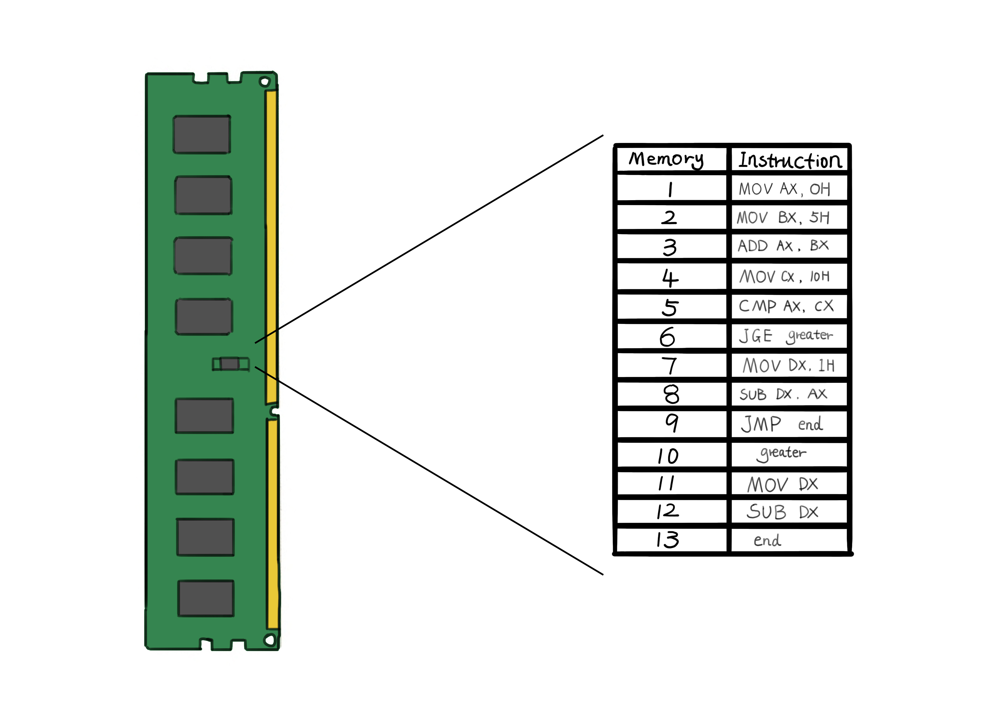
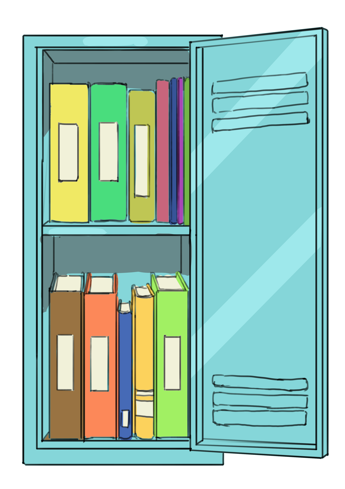
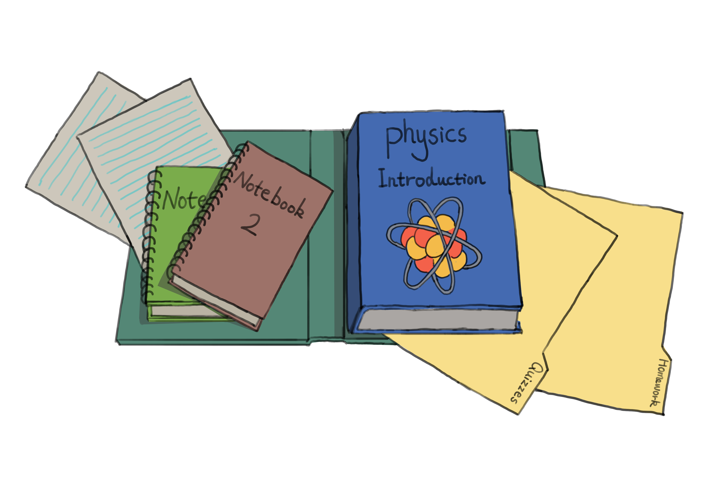
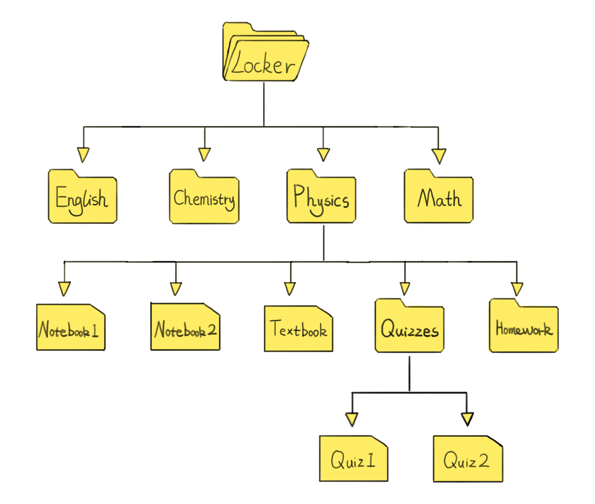
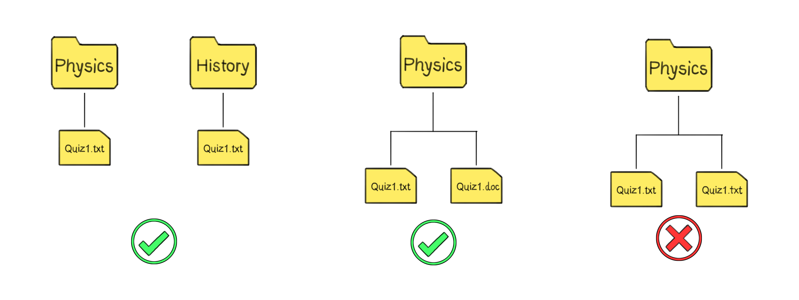
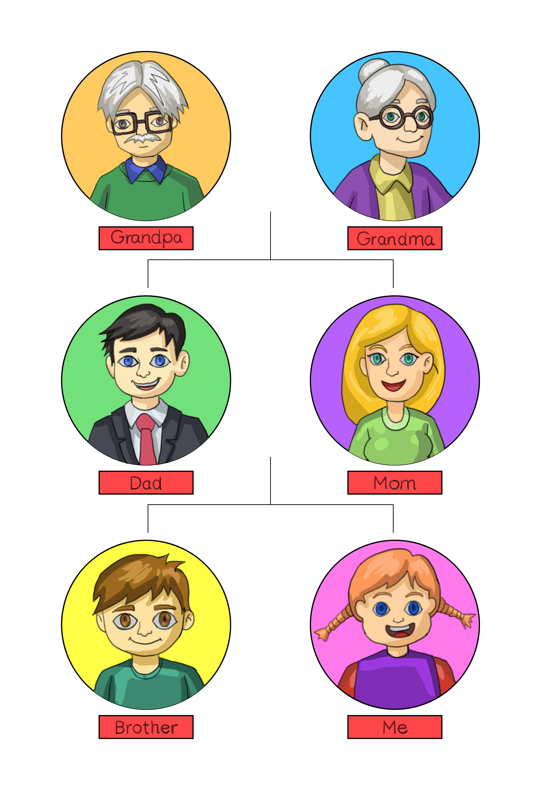

In the previous article, we explored the history of computers and their defining characteristics. Now, let's delve deeper into general-purpose computers and their underlying concepts such as operating systems and file systems.

## Table of Contents

[Hardware and Software](#hardware-and-software)

[Operating System](#operating-system)

[The File System: A School Analogy](#the-file-system-a-school-analogy)

[The File System](#the-file-system)

- [File Naming](#file-naming)
- [File Path](#file-path)
- [Working Directory](#working-directory)

[Questions](#questions)

## Hardware and Software

As we saw in the last article, a computer fundamentally consists of 4 parts:

1. the input,
2. the processing unit,
3. the memory (or storage), and
4. the output.

**Input:** This is where data enters the system. Devices like the keyboard, mouse, touchpad, camera, and microphone capture and transmit information to the computer for processing.

**Processing Unit:** The CPU (Central Processing Unit) is the computer's brain. It handles data computations, command executions, and managing the overall operations of the computer.

**Memory and Storage:** Two methods work in tandem when saving information on a laptop. The long-term "storage" is provided by hard disk drives (HDD) or solid-state drives (SSD), while temporary "memory" comes in the form of Random Access Memory (RAM).

> Note: The distinction between memory (RAM) and storage (HDD/SSD) is crucial. Delve deeper into storage [here](https://student.cs.uwaterloo.ca/~cs100/F21content/02-03-secondary-storage.html) and into memory [here](https://student.cs.uwaterloo.ca/~cs100/F21content/02-04-memory.html). Be aware: the author uses "primary memory" for "memory" and "secondary storage" for "storage" — it's just a terminology choice.

**Output:** After processing, the data is presented as output. On a laptop, the screen is the primary output device, visualizing data. Additionally, devices like speakers, headphone jacks, printers, or external monitors represent other forms of output.


*An illustration of a modern laptop, along with representing the four key components of computing: input, output, processing, and memory.*

All the devices mentioned here, such as the keyboard, the CPU, the hard drive, and the screen, are known as hardware. **Hardware** is "hard" to the touch. It's tangible. In other words, you can actually touch it and hold it; it's the physical parts of the computer. It's also "hard" to change it. If you buy a laptop, the components on the laptop's motherboard are soldered onto the board, making the hardware fixed and hard to modify.

On the other hand, we have software. Software is soft. It's the programs we run on our computer. In other words, it's not something physical that you can touch or feel. Can you touch a video game, or the Google search engine? Nope. It's also soft in the sense that it's flexible. One minute, you can run Microsoft Word, and the next, you might run Photoshop. Software can easily be changed, modified, or removed.


*A modern laptop showcasing the intangible yet dynamic nature of software applications.*

## Operating System

Integrating hardware and software poses an intriguing question. Without hardware, software remains an abstract concept; without software, hardware becomes an unutilized piece of machinery. They complement each other: hardware provides a platform for software, while software brings functionality to hardware.

Software is stored in a computer's memory, which can be conceptualized as a series of "slots." Each slot stores a unit of information. For the sake of simplicity, imagine that each slot holds a single instruction or command. If we have a sequence of 10 commands, these would occupy 10 adjacent memory slots. The CPU starts by processing the instruction in slot #1, then proceeds sequentially, concluding with the instruction in slot #10. This sequence of instructions collectively forms a program, essentially a set of commands for the CPU to execute.


*A memory stick with magnified memory slots, each storing an instruction as part of a computer program.*

> Note: The term "slots" used here is a simplified representation. In computer terminology, these are more accurately referred to as memory locations or addresses, each uniquely identifiable and accessible by the CPU.

So far, so good, right? Not too complicated.

Now consider this: different devices such as a Mac computer, an iPhone, a Samsung phone, and a Lenovo laptop have different hardware made by various companies. This means they each might run programs in their own unique way. Plus, we often connect extra devices like mice, keyboards, screens, or printers.

Imagine if software developers had to make separate versions of a program for each different device – one for Lenovo, another for Apple, another for phones specifically using a Qualcomm chip, and so on. That would be exhausting! And this is actually how things were done back in the 1970s and some of the 1980s.

This is where operating systems (or OS) come in. They act like a translator, or a middleman, smoothing out the communication between the hardware and software. In simple terms, an operating system is low-level software that's specially designed to work closely with the actual hardware of a device.


*The operating system acts as an intermediary, facilitating seamless interaction between the user, software, and hardware components of a computer system.*

The operating system abstracts the complexities of hardware, providing a uniform environment for software developers to create applications. It also provides regular everyday computer users with their familiar view of the computer: the GUI (pronounced as "Gee-You-Eye"), or Graphical User Interface. When we turn on a Windows computer, there is a style of interface and layout that we expect to see, and it's a similar story when we turn on a device running macOS, iOS, or Android.

Whether creating a new folder, running two programs simultaneously, saving a text document, or plugging a brand new mouse into the USB port, the operating system takes care of all this for us. The operating system takes care of anything that the user shouldn't have to worry about. For example, when was the last time you told your computer how to allocate its memory space, e.g. Microsoft Word should have memory slots #1 - #10000 and Adobe Photoshop should take memory slots #10001 - #21000? When did you last wonder where to save your essay file in your hard drive or SSD? Never. Just pick a folder, click "Save," and the operating system will handle the rest.

All in all, operating systems play a vital role in harmonizing hardware and software components. They provide the necessary abstractions, services, and interfaces to ensure compatibility, efficient resource utilization, and seamless communication between different devices and software applications.

## The File System: A School Analogy

Imagine this. It's 8:27AM, and you just reached your school locker. You have a strict Physics teacher who closes the classroom door at 8:30AM. No ifs, buts or maybes. You frantically turn the lock combination, open the door, and a bunch of books and papers come crashing down on your feet. You kneel down, pick up a paper, and "Oh no, this one's yesterday's History quiz! This one's the Math book. Ugh, it looks so similar to the Physics book!"... long story short, you're late for class.


*A cluttered locker with books and papers tumbling out.*

Now imagine a different scenario. It's 8:27AM, and you just reached your school locker. You turn the lock combination, open the locker, and are greeted by the organized shelves. You read the folder labels: "History, no. Math, no. Chemistry, no. Physics, perfect!". You pull out the "Physics" folder, which you know contains everything you'll need for the session, lock the door, and head to class. It's 8:28AM, by the way.


*A neat locker with clearly labeled folders.*

Continuing with this organized version of you, once seated in the classroom, you open your Physics folder. Inside, you see two smaller folders, two notebooks, some blank sheets (handy for surprise quizzes or jotting down notes), and the core Physics textbook. The subfolders are clearly labeled "Quizzes" and "Homework", each holding its own set of notebooks and sheets.


*Inside the Physics folder.*

> Note: there isn't a single "correct" method to sort your files. Your style might work wonders for you, while an equally organized classmate might stash their Physics materials inside a broader "Science" folder. This larger folder could house both "Physics" and "Chemistry" folders, and perhaps their spare sheets of paper are always tucked away within the Quizzes folder.

## The File System

Let's now transition to the computer's way of organizing files and folders. This is a crucial aspect that the operating system takes care of, ensuring that information is not all jumbled together. Remember, all data is stored as a sequence of 1's and 0's, but the operating system creates a virtual boundary between one piece of data and the next.

We have an idea of what a folder is in real life, and it's no different when it comes to computers; it's a way to separate and organize data. It is important to note that "directory" is oftentimes used interchangeably with "folder". Now, what is a "file"?

> Historically, the term "directory" was created first, and then the term "folder" was introduced with the advent of the GUI.

In the realm of computers, a file resembles the items you'd find inside your school locker. It is a named collection of data stored on a computer's storage system. Just like your school book, notebook, or piece of paper, a computer file can hold various types of information, such as text, images, videos, audio or program instructions.


*The file system can be viewed as an inverted tree, with the root at the top and leaves at the bottom.*

> To get a better understanding of how computers view and represent images, [read this](http://www.lakelandscomputing.com/binary-images.html).

While folders group related files together, a file represents the actual data. Think of it as the content of a specific book, notebook, or piece of paper in your locker.

### File Naming

When you sift through your Physics folder in school, you can immediately tell the difference between a sheet of paper and a notebook. You can see and feel the difference. Both contain information, but they are clearly different.

When it comes to computer files, they aren't actual objects we can hold and say "this is a JPG image file" or "this one's a simple text file". Calling some file "image1" doesn't make it an image because it could also just be text describing an image.

So, rule number one is to always specify the file type. How? By adding a filename extension. For example, "image1.png", "image1.jpg", or "image1.txt".

> Note: Most of us rely on applications that handle this automatically. If you’re working on a Microsoft Word document and hit 'Save', it typically gets stored with a ".doc" or ".docx" extension. Similarly, when editing images in Adobe Photoshop, the program wouldn’t prompt you to save with a ".txt" extension.

The second thing to realize is that in your Physics folder, you will **not** have two sheets of paper both labeled "Quiz 1". That would be confusing. But if you had a notebook labeled "Quiz 1" and a loose sheet of paper labeled "Quiz 1", then there is some distinction, and you can distinguish between them. Furthermore, you can have a paper labeled "Quiz 1" in the Physics folder and one in the History folder, and that is okay as well, as long as they are in different folders.

It's a similar story with computer files. Each file has a name that uniquely identifies it within a folder. This means you can have a file named "quiz1.txt" in both the Document folder and the Desktop folder. Moreover, within the same folder, you can have files with the same base name but different extensions, like "quiz1.txt" and "quiz1.doc". The different extensions indicate distinct file types, allowing them to coexist in the same folder without any conflict.


*File naming conventions maintain digital clarity and coherence.*

### File Path

Suppose you want to review your Quiz 1 for your Physics class. In that case, there is an underlying path to get to Quiz 1:

1. Open your locker.
2. Open the Physics folder.
3. Open the Quizzes folder.
4. Grab Quiz 1.

A simple way to represent the path that you took to get to your Physics Quiz 1 is as follows:

```text
Locker > Physics > Quizzes > Quiz 1
```


*An example of a path, highlighted in red.*

This is exactly how a computer's file system operates. Every computer has a starting folder known as the root folder. It's analogous to the locker in our example, a primary container for all other folders. For Linux and macOS, the root folder is marked by a forward slash (/), whereas Windows denotes it by a drive (hard drive or solid-state drive) letter, say "C:".

> Task: Take a moment to find the root folder on your computer. Explore its contents. And if you're unsure how to find it, just ask Google!

Within the root folder, you will have subfolders. The subfolders will call the root folder their "parent folder" or "parent directory". Just like in a family tree, parents are on top, and kids are at the bottom.


*A family tree diagram, showing parent-child relationships similar to folder structures in a file system.*

### Working Directory

Let's go back to the school analogy. Say you have the following file path to get to Physics Quiz 1.

```text
Locker > Physics > Quizzes > Quiz 1
```

Let's now say that you are in the middle of opening your locker. In other words, you are at this step:

```text
Locker > 
```

If you look at all the folders directly available to you, you may find folders such as Physics, Chemistry, History, Math, English, Ethics, so on and so forth. At the Locker level, you cannot access Quiz 1.

In order to get to the quiz, you will have to, one by one, go through the folders as follows:

```text
Locker > Physics > 
```

```text
Locker > Physics > Quizzes 
```

At this point, you will have direct access to Quiz 1.

The **working directory** is the present folder you've opened and are exploring. It's the one where you can directly see and access its files and subfolders.

For example, if you want to see your Physics Quiz 1, your working directory must be the Quizzes folder mentioned earlier. To view all your subjects, the Locker needs to be your working directory. You cannot see all your subjects if you're in Physics class and viewing your Physics folder, right?

In computing terms, the working directory is the current directory or folder where a user is actively operating within a file system. By default, any program or command will run and search in this location unless you specify a different path.

For instance, let's say you've just started taking French classes. You need to create a new folder named "French". You wouldn't do this inside:

```text
Locker > English >
```

Right? Because French isn't a subset of English. Instead, you'd navigate to:

```text
Locker >
```

And create the French folder there, alongside your other subjects. In computer jargon, you set this Locker directory as your **working directory** so you could correctly position the French folder. This captures the essence of a working directory: the folder you're currently navigating or "working" within.

> Note: If your school offers multiple language courses like English and Spanish, you might already have a Languages folder. In this case, you should add the new French folder to the existing Languages folder, rather than placing it directly under Locker.
