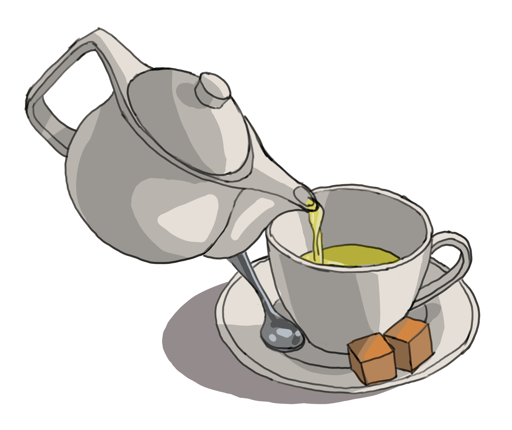

As we venture deeper into the realm of programming and problem-solving, the importance of structured thinking becomes evident. Central to this idea is the concept of algorithms, which act as blueprints for action. Let's dive deeper into what algorithms are and how they can be visually represented using flowcharts.

[Understanding Algorithms](#understanding-algorithms)

[Introduction to Flowcharts](#introduction-to-flowcharts)

[Convert a Problem into a Flowchart](#convert-a-problem-into-a-flowchart)

[Activities](#activities)

[Questions](#questions)

## Understanding Algorithms

An algorithm is a well-defined series of steps to solve a specific problem or accomplish a task. Algorithms are everywhere, not just in computing. They're essentially a recipe: a series of discrete, step-by-step instructions that, when followed precisely, leads to a predictable outcome.

Imagine you're teaching someone to tie their shoelaces. The instructions you give them, starting from holding the two ends of the laces to the final tightening of the knot, constitute an algorithm.

Now, consider a more complex scenario: robots in a competition. In such a contest, a robot might be tasked to collect a ball from the ground and shoot it into a basket.

*A robot shooting a basketball during a competition.*

The robot doesn't act on instinct or intuition; instead, it follows a strict set of instructions - its algorithm. The algorithm could look something like this:

1. Scan the surroundings for a ball.
2. Navigate towards the ball while avoiding obstacles.
3. Pick up the ball.
4. Identify the location of the basket.
5. Calculate the right angle and force to shoot the ball into the basket.
6. Shoot the ball.

*A flowchart diagram showing the steps for a robot to shoot a ball.*

Even though it might seem simple to us, each of these steps needs to be meticulously defined for a robot to perform them. How does it "scan" or "pick up the ball"? Each of these larger tasks can be further decomposed into smaller, more precise actions, each constituting part of the overall algorithm.

## Introduction to Flowcharts

While algorithms can be written down as a list of instructions, for complex tasks, a visual representation can be more intuitive. Enter flowcharts.

A flowchart uses symbols to represent different types of actions or steps. Key symbols include:

- Oval: Represents the start or end of a process.
- Rectangle: Denotes a process or action step.
- Diamond: Used for decisions, often questions that yield 'yes' or 'no' answers.
- Arrow: Dictates the flow of the process.

[Illustration of these symbols with labels: For the robot example, a flowchart could visually depict the process from scanning the environment to shooting the ball, highlighting decisions (like whether a ball is found) and actions (like navigating or shooting).]

### Convert a Problem into a Flowchart

Converting a problem into a flowchart involves breaking down the problem into individual steps or processes, then representing those steps graphically. Let's take a straightforward example: making a cup of tea.

#### Step 1: Define the problem

Understand what you're trying to achieve. In our example, the problem or task is: Make a cup of tea.

#### Step 2: List down the steps

Write down every step involved in the process. For our tea example, it might look like this:

- Fill the kettle with water.
- Boil the water.
- Place a teabag in the cup.
- Pour the boiled water into the cup.
- Wait a couple of minutes.
- Remove the teabag from the cup.

#### Step 3: Start drawing the flowchart

**Begin at the start:**
Draw an oval labeled "Start". This will be the entry point of your flowchart.

*Start of a flowchart diagram: an oval labeled "Start".*

**Go step-by-step:**
Now, take your first step ("Fill the kettle with water.") and represent it with a rectangle. Draw an arrow from "Start" to this rectangle.

*Addition of a rectangle representing the first task.*

From this rectangle, draw another arrow leading to the next step ("Boil the water.") represented by another rectangle. This intuitive method is like walking through the process yourself and marking down each step as you complete it.

*Addition of a rectangle representing the second task.*

**Incorporate decisions:**
When you encounter a step that involves making a decision, use a diamond shape. For instance, after removing the teabag, there might be a decision: "Add sugar?". If "Yes", you'd show the steps to add sugar; if "No", you'd proceed to the end.

**Continue until the end:**
Keep drawing arrows from one rectangle to the next as you move through your list of steps. After the last step, draw an arrow to a rounded rectangle labeled "End".

*Complete flowchart of the tea-making process.*

#### Step 4: Review

Once you've drawn out each step from your list, take a moment to review the flowchart. Walk through each step and decision in your mind to ensure nothing is missing and the flow is logical.

The intuitive approach is like narrating a story to yourself. You're recounting the tale of making a cup of tea, from start to finish. By following each step as you would in real life and drawing it out in sequence, you create a visual representation of the process.

*Tea being poured into a cup.*

By using this systematic approach, you can turn any problem or process into a clear, visual flowchart.

Remember, algorithms and flowcharts are all about breaking down problems and representing solutions in a structured manner. As you become more familiar with them, they'll become invaluable tools in your problem-solving toolkit!

## Activities

### Activity #1

Think of a daily routine. Describe the sequence and decision-making process of your routine as if you were guiding someone through the steps. For instance, consider the routine of getting ready for work in the morning.

*A student headed to school.*

### Answer

Routine: Getting ready for work in the morning

1. Wake up when the alarm rings.
2. Turn off the alarm.
3. Check the weather.
4. Put on basic clothing.
5. Go to the bathroom to brush teeth and wash face.
6. Eat breakfast.
7. Decision: Is it raining?
    - Yes: Wear rain-appropriate attire and carry an umbrella.
    - No: Wear regular attire.
8. Grab your schoolbag, ensuring the essentials are inside.
9. Leave the house and head to school.

This sequence lists out the steps and includes a decision-making point regarding the weather, which affects the choice of attire for the day.

### Activity #2

Imagine you have a humanoid robot. This robot can flawlessly execute every command you give but understands only fundamental commands, such as "lift your right foot 5 centimeters" or "turn your head 90 degrees left". It's unable to process abstract or compound actions like "walk forward".

You want to instruct the robot to move 30 centimeters forward. Describe in detail the series of commands you would provide to ensure the robot moves the desired distance.

### Answer

To instruct the robot to move 30 centimeters forward with each leg, one after another, you would give the following commands:

1. Lift the right foot 5 centimeters.
2. Move the right foot 30 centimeters forward.
3. Lower the right foot until it touches the ground.
4. Transfer the weight to the right foot.
5. Lift the left foot 5 centimeters.
6. Move the left foot 30 centimeters forward.
7. Lower the left foot until it touches the ground.
8. Distribute the weight evenly between both legs, achieving a 50/50 balance.

These commands ensure the robot takes a single step with each leg, moving a total of 30 centimeters forward.

*Completed flowchart of a robot walking.*
