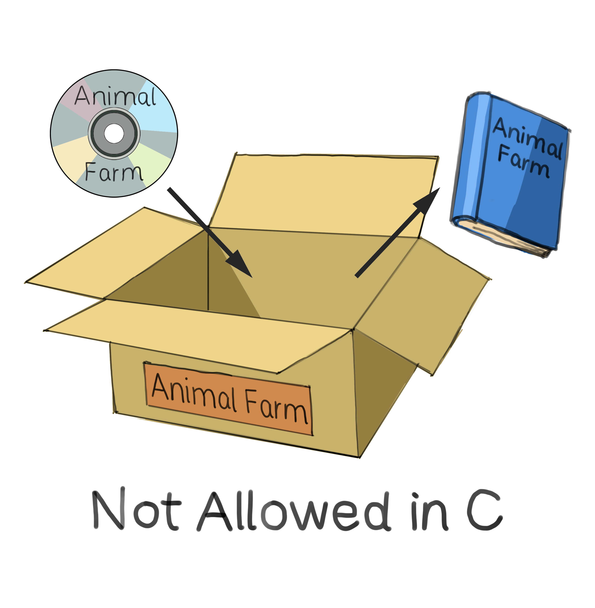

In daily life, we deal with different types of data. We classify items by color, size, shape, and various other attributes. Similarly, in programming, understanding data types and how they are managed is essential to designing efficient and effective programs.

## Table of Contents

[Understanding Data Types](#understanding-data-types)

[Common Data Types in Programming](#common-data-types-in-programming)

[Variables: Labeled Boxes for Data](#variables-labeled-boxes-for-data)

- [Why Labeled Boxes?](#why-labeled-boxes)
- [Benefits of Using Variables](#benefits-of-using-variables)
- [Assigning Values to Variables](#assigning-values-to-variables)
- [Changing Variable Values](#changing-variable-values)
- [Variable Naming Rules and Conventions](#variable-naming-rules-and-conventions)

[Strong vs. Weak Typing: C and Python Examples](#strong-vs-weak-typing-c-and-python-examples)

- [Strongly Typed Languages](#strongly-typed-languages)
- [Weakly Typed Languages](#weakly-typed-languages)

[Activities](#activities)

[Questions](#questions)

## Understanding Data Types

Imagine walking into a library. In this library, there are various items: books, CDs, newspapers. Each of these items can be thought of as a different "type" of data in this library.

- Books:
  - Operations: You can read them, bookmark pages, and sometimes write notes.
  - Storage: Kept on specific shelves, categorized by genre or author.
- CDs:
  - Operations: You can listen to them, skip tracks, or repeat songs.
  - Storage: Stored in CD racks or cases.
- Newspapers:
  - Operations: Read articles, check out advertisements, or solve puzzles.
  - Storage: Kept in stacks or in special newspaper stands.

Just as different items in a library have distinct operations and storage methods, data types in programming have their unique ways of being manipulated and stored. For instance, in the library, you wouldn't try to "listen" to a book or "read" a CD. Similarly, in our daily lives, you wouldn't "peel" a number like a fruit or "wear" it like a shirt. Understanding and respecting these distinctions in programming ensures that we use data appropriately and efficiently.


*A box labeled "Harry Potter Series", illustrating variables in programming as organizational tools for data.*

## Common Data Types in Programming

At their core, most programming languages support a set of basic or "primitive" data types:

- Integers (int): Whole numbers, both positive and negative. e.g., -3, 0, 42.
- Floating-point numbers (float): Decimal numbers. e.g., 3.14, -0.001.
- Booleans (boolean): Represented by two values, either 'True' or 'False'. e.g., "the sky is blue" (True), "7 > 13" (False).
- Strings (string): Sequences of characters. e.g., *"Hello, World!"* or *"I am 15 years old"*.

> Note: While these are general categories, the exact naming and behavior might differ slightly from one programming language to another.

## Variables: Labeled Boxes for Data

### Why Labeled Boxes?

Imagine your room filled with various items: books, CDs, toys, and more. Without a proper system, finding a specific item becomes a daunting task. But what if you had labeled boxes? Each box not only holds items but also comes with a specific label telling you what's inside. For instance, a box labeled "Harry Potter Series" would contain all the books from that series. With this approach, it's much easier to locate, access, or replace any item.

In programming, these "labeled boxes" are what we refer to as variables. They allow us to store, manage, and retrieve data efficiently.


*A box labeled "Harry Potter Series", illustrating variables in programming as organizational tools for data.*

### Benefits of Using Variables

- Organizing Complexity: Variables are like street names in a city, helping us navigate the complex world of programming by giving data meaningful identifiers.
- Flexibility & Adaptability: Just as preferences change in real life, data can change in programs. Variables allow for dynamic data adjustment, making our programs adaptable.
- Consistency & Safety: Data types set clear rules for what a variable can hold, ensuring data is handled correctly and preventing potential errors.
- Efficiency: Like organizing items in a warehouse, data types help the computer store data optimally, ensuring peak performance.

In coding, variables and data types serve as critical organizational tools, enhancing flexibility, accuracy, and speed. Dive into some pseudocode examples to see them in action.

### Assigning Values to Variables

Assigning a value to a variable is like placing an item inside a labeled box.

Imagine finding a box and labelling it *"Animal Farm"*, and then putting the book "Animal Farm" inside it.


*A box labeled "Animal Farm", symbolizing the assignment of a value to a variable in programming.*

You can also label that box *"Favorite Book"*, and still put the book "Animal Farm" inside it. The label is just a label, and it's there to help you remember what's inside the box.


*A box labeled "Favorite Book" containing "Animal Farm", demonstrating how variables in programming flexibly label and store data.*

In programming, this is typically done with an "equals" sign (=). The variable name comes on the left, and the value you want to store comes on the right.

As we saw before, programming languages don't have "book", "CD", or "newspaper" as data type. Instead, they have integers, floats, Strings and Booleans just to name a few.

```python
variable_name = value
```

For example:

```python
title = "Animal Farm"
author = "George Orwell"
```

Notice that author contains a String type.

### Changing Variable Values

A variable's value can be updated or changed throughout a program. This is especially true for weakly typed languages:

```python
variable_name = value
variable_name = new_value
```

### Variable Naming Rules and Conventions

You may have noticed that the variable names follow a certain style. Here are some rules and conventions that programmers follow in order to ensure code clarity and prevent potentials errors.


#### Mandatory Rules

1. **Valid Characters:**
    - Use only letters (a-z, A-Z), numbers (0-9), and underscores (_).
    - Example: `motor_speed`, `axis3_value`.
2. **Starting Character:**
    - Always begin with a letter (a-z, A-Z) or an underscore (_). Never start with a number.
    - Example: `sensor_reading` (correct), `_backup_value` (correct), `3rd_motor` (incorrect).
3. **Reserved Words:**
    - Don't use language-specific keywords.
    - Example: Avoid naming a variable *int*, *return*, *if*, etc. as they are common reserved words in many languages.

#### Best Practices

1. **Spacing:**
    - It's more readable to place a space before and after the equals sign.
    - Example: `wheel_rotation = 45` instead of `wheel_rotation=45`.
2. **Capitalization:**
    - Start with a lowercase letter. For multi-word names, use camelCase or snake_case.
    - Example: `robotArmPosition` (camelCase), `robot_arm_position` (snake_case).
3. **Descriptiveness:**
    - Opt for clear names that describe their purpose.
    - Example: `battery_voltage` (clear) over `bv` (vague).
4. **Consistency:**
    - Stick to a chosen naming style throughout your code.
    - Example: If you start with snake_case (`motor_speed`), don't mix with camelCase (`robotArm`) in the same codebase.

> Tip: Although the "Best Practices" aren't strict rules, adhering to them can greatly enhance the clarity and maintainability of your code.

## Strong vs. Weak Typing: C and Python Examples

In programming, languages differ in how strictly they enforce data types, leading to the concepts of strong and weak typing.

### Strongly Typed Languages

In these languages, the data type of a variable is set when the variable is declared, and it can't change unless explicitly redefined. For instance, if you declare a variable to be of type integer, you can't just assign a string value to it later on. C is an example of a strongly typed language.

[Illustration of box titled "Animal Farm" with a book inside titled animal farm. Next image is removal of the book from the box, and insertion of a DVD of Animal Farm the cartoon. At the bottom, it says "Not Allowed in C"]


*A box labeled 'Animal Farm' initially holding a book, then attempting to insert a DVD, which is not allowed in a language like C that uses strict type enforcement.*

#### C Example

```c
int motorSpeed = 100;
motorSpeed = "fast"; // This results in an error
```

In the above example, once the `motorSpeed` variable is defined as an integer (`100`), trying to assign a string value to it (`"fast"`) will result in an error.

### Weakly Typed Languages

Conversely, weakly typed languages allow for more flexibility with variable data types. A variable's type can change over the course of a program. This flexibility is double-edged; while it can simplify code, it can also lead to unexpected behaviors if not used carefully. Python is an example of a weakly typed language.

[Illustration of box titled "Animal Farm" with a book inside titled animal farm. Next image is removal of the book from the box, and insertion of a DVD of Animal Farm the cartoon. At the bottom, it says "Allowed in Python"]


*A box labeled 'Animal Farm' first containing a book and then accepting a DVD, illustrating type flexibility in languages like Python.*

#### Python Example

```python
motorSpeed = 100
motorSpeed = "fast"  # This is valid in Python
```

In the Python example, the *motorSpeed* variable can easily transition from holding an integer to a string without any errors.

In summary, while strongly typed languages prioritize strict adherence to data types for accuracy and predictability, weakly typed languages offer flexibility, which can speed up development but requires extra caution.

## Activities

**Activity #1:**

Given a list of variable names and their descriptions, identify which names are correctly named (following mandatory rules and best practices) and which are not.

- *123data*: Holds information about a dataset.
- *user-response*: User's feedback on a survey.
- *computeValue*: Calculates a specific value based on an algorithm.
- *if*: Represents a number in decimal format.
- *UserAddress*: Stores user's home address.
- *tad*: Calculates the total amount due.

**Answer:**

- *123data*:
  - **Incorrect** (Starts with a number)
  - **Suggested name:** *data123* or *dataset*
- *user-response*:
  - **Incorrect** (Contains a hyphen)
  - **Suggested name**: *userResponse* (camelCase) or *user_response* (snake_case)
- *computeValue*:
  - **Correct**
- *if*:
  - **Incorrect** (Keyword in most programming languages)
- *UserAddress*:
  - **Allowed but not good** (Not following best practice of starting variable name with a lowercase letter)
  - **Suggested name**: *userAddress*
- *tad*:
  - **Allowed but not good** (Not following best practice of being descriptive)
  - **Suggested name**: *totalAmountDue*

**Activity #2:**

Given a list of variables and their assigned values, determine the probable data type of each variable. Write down why you believe each variable is of the chosen data type.

- `temperature = 23.5`
- `isActive = True`
- `username = "Charlie_01"`
- `studentCount = 150`
- `username1 = Charlie_01`

**Answer:**

- *temperature*: float (Because it's a decimal number)
- *isActive*: boolean (It's either True or False)
- *username*: string (Sequence of characters enclosed in quotes)
- *studentCount*: integer (Whole number without decimal points)
- *username1*: Not a valid datatype assignment
