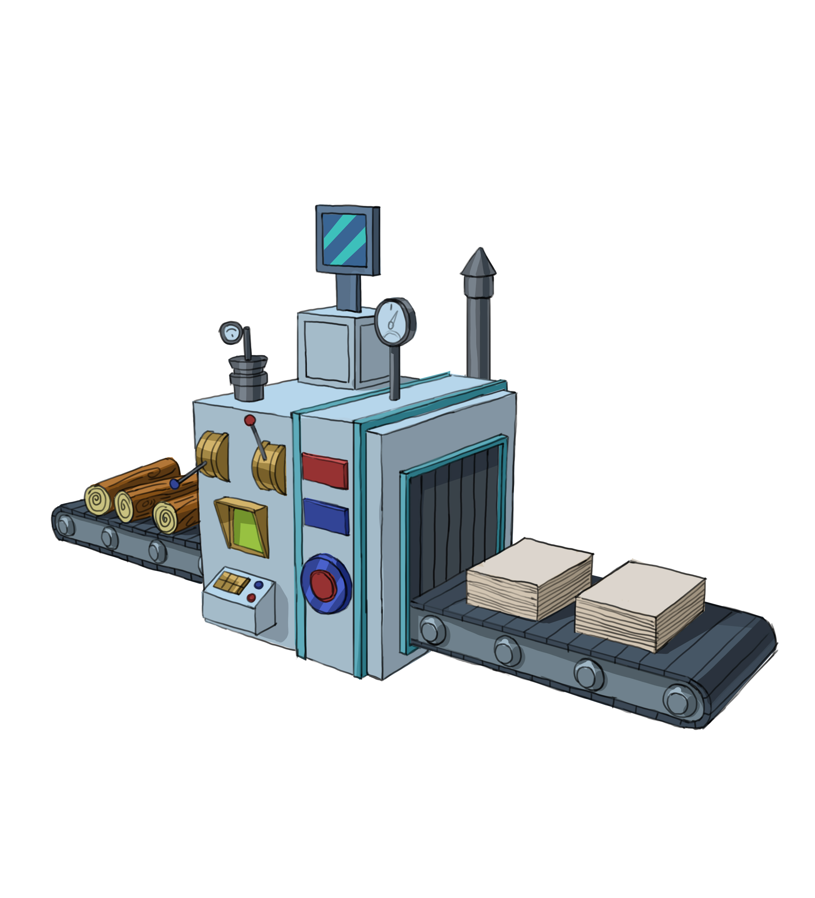
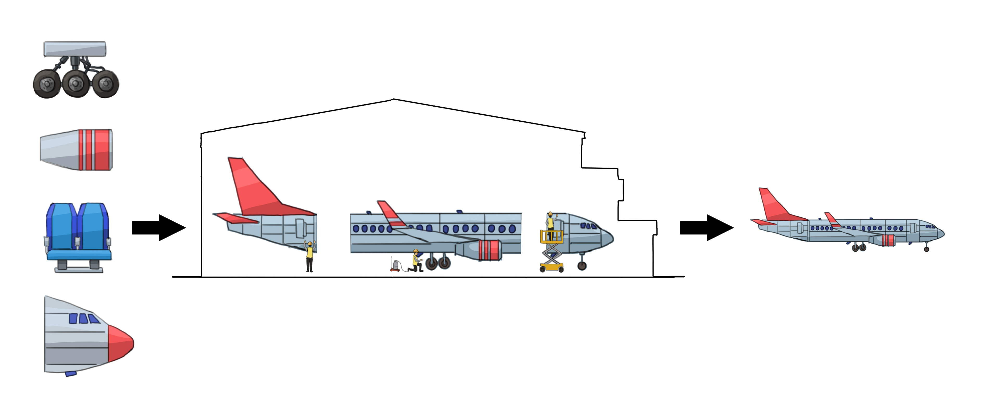
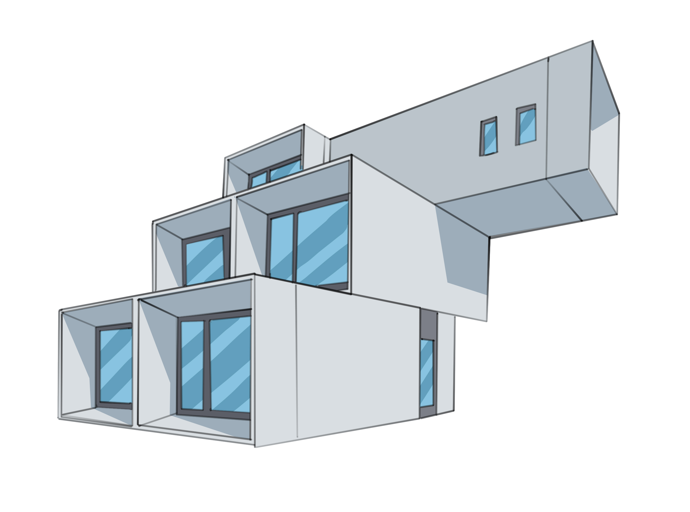

In daily tasks, we often break things down into steps: making a sandwich involves selecting ingredients, assembling, and finally eating. Similarly, in programming, we modularize our code using "functions", turning complex tasks into manageable, step-by-step processes.

## Table of Contents

[Introduction to Modularization](#introduction-to-modularization)

[Understanding Functions](#understanding-functions)

[Why Modularize?](#why-modularize)

[Anatomy of a Function](#anatomy-of-a-function)

- [Function Definition and its Parameters](#function-definition-and-its-parameters)
- [Function Call and its Arguments](#function-call-and-its-arguments)
- [Return Mechanism](#return-mechanism)

[Designing with Modularity in Mind](#designing-with-modularity-in-mind)

[Activities](#activities)

[Questions](#questions)

## Introduction to Modularization

We learned in Chapter 1 about the importance of breaking down a problem. We learned to tackled complex challenges by splitting them into smaller, more manageable tasks. This approach mirrors a fundamental principle in the world of programming called modularization. Just as one wouldn't try to build an entire house in a single step, developers don't aim to create an entire program all at once. Instead, they break their code into smaller, self-contained pieces called modules or functions. These modules can be created, refined, and tested individually. This division not only simplifies the coding process but also makes pinpointing and fixing errors much more straightforward.

## Understanding Functions

Imagine a mysterious black box. You don't know what's inside it, but you're given a manual which tells you what the box needs and what it will produce. You feed the box what it asks for, and out comes a predictable result, exactly as the manual described. That's the essence of a function in programming. Like this black box, a function takes in certain inputs, processes them internally, and produces an output. You don't always have to understand the complex details of its internal workings; you just need to know what inputs it requires and what outputs it will produce.


*A machine taking specific inputs and producing a predictable output, akin to the operation of functions in programming.*

Now, consider an airplane-manufacturing plant. You're outside, observing the massive building, and throughout the day, trucks come in loaded with plane parts. By the end of the day, out rolls a brand-new airplane. This entire plant can be visualized as a single function: plane parts go in as input, and a ready-to-fly airplane comes out as the output.


*A factory receiving airplane parts and outputting a completed airplane, symbolizing a function's process of transforming inputs into specific outputs.*

Peaking into this "black box" system, we can see that inside the plant, workers aren't scrambling to assemble an entire airplane in one place. The plant is divided into sections. One section assembles the wings, another the fuselage, yet another the engines, and so on. Each section specializes in one aspect, doing its job efficiently. In the end, all these components are combined, resulting in a finished airplane. This reflects the essence of modularization.


*A transparent view inside an airplane manufacturing plant with distinct sections for assembling various parts, illustrating the principle of modularization.*

Much like the specialized sections in the airplane-manufacturing plant, functions in programming allow developers to break down complex tasks into smaller, more manageable pieces. This not only makes the code more organized but also easier to debug, maintain, and reuse.

## Why Modularize?

Let's briefly compare the state of the assembly plant without modularity, and then with modularity. This contrast will set the stage for a deeper understanding of its significance and benefits.

### Example Without Modularity

Imagine an airplane manufacturing plant where there's only one large assembly line, and every part of the airplane is constructed sequentially in this single line:

1. Crafting the fuselage
2. Assembling the wings
3. Integrating the engines
4. Fitting the landing gears
5. Installing the cockpit instruments
6. ... and so forth.

**Challenges:**

- If there's a mistake during the crafting of the fuselage, the entire assembly line might need to be paused or adjusted.
- Distributing tasks among teams is challenging because everything is interconnected in one continuous flow.
- Introducing a new design or modification, such as a change in wing shape or engine type, would disrupt the entire assembly process.

### Example with Modularity

In a more modular approach, the airplane manufacturing plant has separate assembly lines or stations for each major part.

Each station functions as an independent module. Once all parts are ready, they come together in a final assembly line.



**Advantages:**

- If there's an issue with the fuselage design, it can be addressed without affecting the wing or engine assembly.
- Tasks can be distributed efficiently among specialized teams.
- Design modifications or upgrades become simpler. If there's a new wing design, it's adjusted at the wing assembly station without disrupting other stations.

## Anatomy of a Function

Now that we've seen the overall system, let’s dive deeper to understand one of its core sections: the fuselage assembly area. This is where the main body of the plane gets pieced together.

### Function Definition and its Parameters

Imagine a section of the plant where the fuselage is assembled. Before assembly starts, the fuselage-assembly team needs some key details like the size of the airplane (small, medium, large) and the number of windows it should have. Without these details, the fuselage-assembly team cannot do their work. Because remember, we have purposefully separated the plane building process, so one group does not have direct access to what the other groups are doing. They are all working independently. So this information needs to be fed to them from, say, the general manager.

In programming, it's the same story. The programmer (general manager) needs to provide the "input" to the function in order for the function to do its job. And these inputs are known as "parameters".

For our fuselage assembly example, the code might look like this:

```typescript
function AssembleFuselage(size, numberOfWindows):
    // Here the fuselage gets assembled.
END function
```

Breaking this down:

- `function`: This is a keyword indicating that we're defining a new function. Think of it as announcing, "Hey, we're setting up a new section of the assembly line here!"
- `AssembleFuselage`: This is the name of the function, much like naming the "fuselage assembly" section. By using this name in our code, we can instruct the function to start its task, just as a project manager would say *"Hey Fuselage-Assembly team, get to work!"*
- `(size, numberOfWindows)`: Inside these parentheses, we have our parameters – the essential details the function needs. In this case, the two parameters are:
  - `size`: This parameter expects a value that indicates the size of the airplane, like "small", "medium", or "large".
  - `numberOfWindows`: This parameter expects a number, indicating how many windows the fuselage should have.
  
  Think of these parameters as the instruction manual or blueprint for the fuselage assembly team. Without these specifics, the team won't know how to proceed.
- `// Here the fuselage gets assembled.`: This is a comment in the pseudocode. It doesn't affect the functionality but is a note to anyone reading the code (or for our analogy, a reminder for the assembly team) about what happens in this section of the function. In a real code setting, this is where the steps or operations to assemble the fuselage would be detailed.
- `END function`: This keyword indicates the function's conclusion. It's a signal that the process defined in this function is complete. Think of it as the signal that the fuselage assembly job is complete.

> You might notice that the comment in the pseudocode is indented (moved a few spaces to the right). This indentation is a convention in programming to show that a piece of code belongs to or is "inside" a specific section, in this case, the AssembleFuselage function. It's the same as the if-else statement and while loop.

The beauty of this approach is that once this function is set up, we can call upon it multiple times with various inputs. If we need a large plane with 20 windows, we simply provide those specific details (known as "arguments" in programming) when we call the function. It's like telling the assembly team to start a new project with a new set of details.

### Function Call and its Arguments

Now that we've established our fuselage assembly section (the function definition) and know the details it requires (parameters), it's time to put it into action. This is like telling the assembly team to start the assembly based on the specifics we've provided.

In programming, when we want a function to carry out its task, we "call" it. And just like the assembly team needs their specific set of blueprints (size and number of windows) to get started, we provide these specifics to the function when we call it. These specific values that we supply during a function call are known as "arguments."

Let's understand this with a direct application:

```typescript
AssembleFuselage("medium", 15)
```

Breaking this down:

- `AssembleFuselage`: We're calling the function by its name, telling it to start the assembly.
- `("medium", 15)`: Here, we're providing the arguments, i.e. the specific details for this particular assembly job. We want a medium-sized airplane with 15 windows.

By calling the function with these arguments, we're instructing our (virtual) assembly team to construct a medium-sized fuselage with 15 windows.

The beauty of functions is their reusability. Need another airplane? No problem! Just call the function again with different arguments:

```typescript
AssembleFuselage("large", 20)
```

Now we're asking for a large airplane with 20 windows. And just like that, with a single line of code (or instruction to our assembly team), we set in motion the entire process to create a different type of airplane.

This is the power of functions: Set up the process once, then initiate it whenever needed with the specifics you desire. Just like having an efficient assembly line that's ready to produce different models of airplanes based on the instructions you provide.

> **What's the difference between a parameter and an argument?** In programming, parameters are the placeholders defined in a function, representing the types of information it requires, much like a blueprint's specifications. For instance, in `AssembleFuselage(size, numberOfWindows)`, `size` and `numberOfWindows` are parameters. Arguments, however, are the actual values you provide when calling the function, such as "medium" and "15" in `AssembleFuselage("medium", 15)`. While parameters set up what a function expects, arguments are the real data you pass to the function for execution.

### Return Mechanism

So far, we've talked about how to create a function and how to call it. In both these discussions, the topic of "input" is involved. But what about the output? If we revisit the basic representation of a function, for every input that we give it, it should give us an output in return.


Consider a scenario where the fuselage-assembly team finishes their work. Sometimes they might need to simply give a status update like "Fuselage Assembly Complete." Other times, they might need to actually present the finished fuselage for inspection or integration with other parts of the plane.

In programming, the "return" mechanism can handle both these scenarios. Once a function completes its task, it can return a simple message or the result of its operation.

Let's illustrate with two pseudocode examples:

**1. Returning a status message:**

```typescript
function AssembleFuselage(size, numberOfWindows):
    // The fuselage gets assembled based on the size and number of windows.
    
    // Once done, a status message is sent back.
    return "Fuselage Assembly Complete"
END function
```

In this case:

- `return`: This keyword indicates that the function is providing an outcome after completing its task.
- `"Fuselage Assembly Complete"`: This is the message the function returns. It's equivalent to the assembly team announcing their completion.

**2. Returning the actual assembled fuselage:**

```typescript
function AssembleFuselage(size, numberOfWindows):
    // The fuselage gets assembled based on the size and number of windows.
    
    // Once done, the assembled fuselage is returned for further use.
    return assembledFuselage
END function
```

In this scenario:

- `return`: Indicates that the function is providing the result of its task.
- `assembledFuselage`: Represents the finished plane part that's being returned. Think of this as the actual fuselage being presented for inspection or integration.

> Note: Again, notice the indentation of the body of the functions. This indicates that those lines of code are inside the function, and it visually separates the body of the function from the rest of the code, making the code structure clear and readable.

Whether it's a status message or the finished product, the return mechanism in programming ensures a clear and efficient handoff, just as it would in an airplane assembly line.

## Designing with Modularity in Mind

When constructing an airplane, for the sake of this example, we'll consider that it's primarily made up of a fuselage, wings, engines, and a cockpit.

**Fuselage Assembly:** The department responsible for assembling the fuselage. Parameters like its size and the number of windows are crucial to this process.

```typescript
function AssembleFuselage(fuselageSize, numberOfWindows):
    // Steps to assemble the fuselage
    return "Fuselage Assembly Complete"
END function
```

**Wing Assembly:** The design and structure of the wings are determined by the specific model of the airplane. Different types may necessitate varying wing configurations.

```typescript
function AssembleWings(typeOfWing):
    // Steps to assemble the chosen type of wing
    return "Wings Assembly Complete"
END function
```

**Engine Installation:** The number of engines an airplane carries depends on its size and purpose. A cargo plane might require more engines than a small commercial jet, for instance.

```typescript
function InstallEngines(numberOfEngines):
    // Steps to install the specified number of engines
    return "Engine Installation Complete"
END function
```

**Cockpit Assembly:** The cockpit's electronic systems are standardized across various airplane models. Given this uniformity, assembling the cockpit doesn't require specific input parameters.

```typescript
function AssembleCockpit():
    // Steps to set up the chosen type of controls
    return "Cockpit Assembly Complete"
END function
```

### Assembling the Entire Airplane

With the above modules, the main assembly function would be:

```typescript
function AssembleAirplane(fuselageSize, numberOfWindows, typeOfWing, numberOfEngines):
    AssembleFuselage(fuselageSize, numberOfWindows)
    AssembleWings(typeOfWing)
    InstallEngines(numberOfEngines)
    AssembleCockpit()
    return "Airplane Assembly Complete"
END function
```

> Note: Notice how the call to `AssembleCockpit()` did not require any arguments to be passed to the function. This is because `AssembleCockpit()` doesn't take any input, and so the parentheses are left empty.

One of the most notable benefits of such a modular design is maintainability. If, for instance, there is an issue or a need for an improvement in the `AssembleWings()` function, there's no need to sift through the overarching `AssembleAirplane()` function. Instead, one would directly approach the specific function where the problem has occurred, making adjustments and optimizations far more straightforward and efficient. This approach not only reduces errors but also saves significant time during the debugging and improvement processes.

## Activities

**Activity #1:**

Create a set of functions for different aspects of planning a birthday party. Think about the key tasks involved in organizing a party and design functions for each of these tasks. You don't need to implement the details of each function; just outline what each function would do.


**Answer:**

Break down the process of organizing a birthday party into smaller, more manageable functions.

Pseudocode:

```typescript
function SendInvitations(listOfFriends):
    // Steps to send out invitations to friends on the list
    return "Invitations Sent"
END function

function OrderCake(cakeType, caseSize):
    // Steps to order a specific type of cake
    return "Cake Ordered"
END function

function DecorateVenue(theme):
    // Steps to decorate the venue based on the chosen theme
    return "Venue Decorated"
END function

function ArrangeMusic(playlist):
    // Steps to set up music based on the chosen playlist
    return "Music Arranged"
END function
```

Since the question only asked us to "design the functions", this means that we don't need to make the actual function calls and complete the task of actually organizing a birthday party. It's like creating an action plan without carrying out the actions.

**Activity #2:**

Write pseudocode for the following three functions, and then make function calls to demonstrate their use.

1. Greet the program user by their username.
2. Display today's date.
3. Provide a recommendation for a movie based on the user's favorite movie.

**Answer:**

Pseudocode:

```typescript
function GreetUser(userName):
    // Greet the user by name
    return "Hello, " + userName + "!"
END function

function DisplayDate():
    // Show today's date
    return todaysDate
END function

function RecommendMovie(favoriteMovie):
    // Suggest a movie for the user to watch based on their favorite movie
    return topRecommendation
END function
```

The function calls of these functions would look like this:

```typescript
GreetUser("John")
DisplayDate()
RecommendMovie("Sherlock Holmes")
```

If you run this code, you will get something like this:

```text
Hello, John!

2023-10-26

Murder on the Orient Express
```

It is important to note that the function `DisplayDate()` does not need any input in order to display today's date. That is why, in its function definition, we do not include any parameters, and similarly, when calling the function, we do not pass any arguments.
