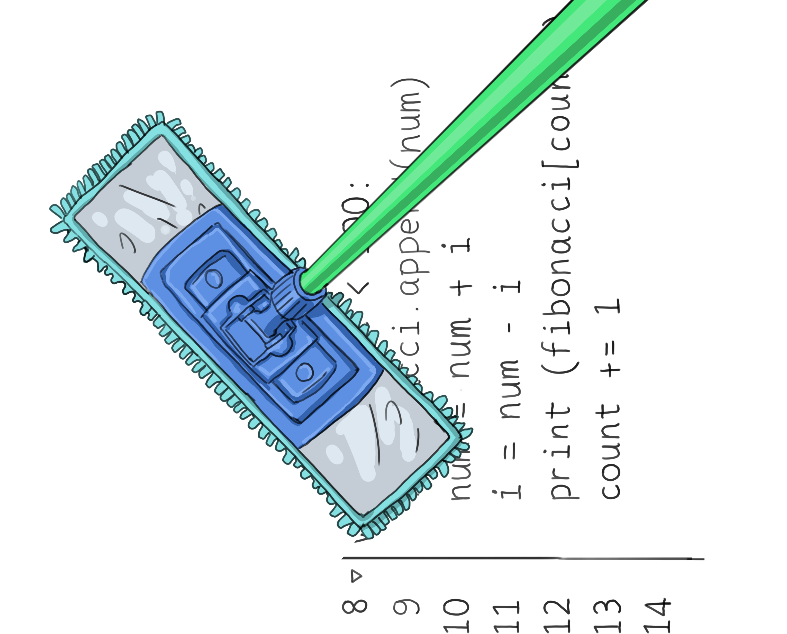

When writing code, it's important not just to make it work, but also to make it readable and maintainable for others (and your future self). This chapter will guide you through the best practices to achieve clean, understandable code.

## Table of Contents

[Some Review: Descriptive Names](#some-review-descriptive-names)

[Code Structure and Formatting](#code-structure-and-formatting)

- [Spacing and Indentation](#spacing-and-indentation)
- [Organizing Variables](#organizing-variables)
- [Logical Segmentation](#logical-segmentation)
- [Avoiding Deep Nesting](#avoiding-deep-nesting)
- [Using Functions to Reduce Repetition](#using-functions-to-reduce-repetition)

[Commenting Properly](#commenting-properly)

- [Bad Commenting Examples](#bad-commenting-examples)
- [Good Commenting Examples](#good-commenting-examples)

[Activities](#activities)

[Questions](#questions)

## Some Review: Descriptive Names

In some previous chapters, we've touched upon some good coding practices, notably providing clear and descriptive names to functions and variables.

Good naming is like giving clear, easy-to-follow instructions. When naming functions, we use verbs to describe actions, making what the function does obvious. So, is the following good enough?

```typescript
function DoThing():
    ...
END function
```

No, because what this function does just by looking at its name is anyone's guess. Now, to understand what the function does, we'd have to go inside the function and try to understand the code.

Instead, you should call it something like:

```typescript
function CalculateTotalScore():
    ...
END function
```

Now, we're not forced to read the code inside this function to understand what it does; we can simply read its name.

When it comes to variables, the names should reflect their content or purpose as well. For instance:

```typescript
playerScore = 0
```

This variable clearly represents the player's score.

> Note: In our made-up pseudocode programming language, we have function names follow the PascalCase notation (e.g. `StartGame()`), and variables follow either camelCase (e.g. `loginAttempts`) or snake_case (e.g. `login_attempts`). Whichever naming convention you decide to use, make sure to stay consistent with it throughout your code.

## Code Structure and Formatting

How you structure and format your code can greatly influence how easy it is to read and maintain. Here's how to keep your code looking neat and organized:

### Spacing and Indentation

Just like paragraphs in a story, code needs to be organized with proper spacing and indentation to tell the computer (and our friends when they try to help us find a bug) what steps to follow and in what order. Indentation helps to show which pieces of code are connected. For example, everything inside a loop should be indented one level deeper, like so:

```typescript
function PrepareTea(numOfGuests):
    i = 0
    while i < numOfGuests:
        AddWater()
        SteepTea()
    END while
END function
```

Notice how the actions inside the loop (adding water and steeping the tea) are indented, showing they are part of the looping action. It's the exact same concept for everything inside the `PrepareTea()` function.

### Organizing Variables

Think of variables like ingredients in a recipe. You want to lay them all out before you start cooking. By grouping related variables at the start, you make your recipe easier to follow. Here's an example:


*You need eggs, flour and sugar to bake a cake.*

```typescript
function BakeCake():
    eggs = 3
    sugar = "1 cup"
    flour = "2 cups"
    
    MixIngredients(eggs, sugar, flour)
    PourBatter()
    Bake()
END function
```

All the ingredients are listed at the top, so it's clear what we need to bake the cake.

### Logical Segmentation

When writing a story, we use paragraphs to separate ideas; in coding, we use blank lines to break up our code into sections. Each part does something different, like setting up the game, playing a round, or ending the game:

```typescript
function PlayGame():
    SetupGame()

    while not gameOver:
        PlayRound()
    END while
    
    EndGame()
END function
```

### Avoiding Deep Nesting


*Deep nesting will get confusing very quickly.*

When we write stories, if we have too many stories within stories, it can become confusing. Similarly, in programming, having too many loops or conditions inside one another (nested) can make code hard to follow. Try to keep things simple:

```typescript
// Try to avoid this
if conditionA:
    if conditionB:
        if conditionC:
            // Code here is deeply nested 
            //and harder to read.
        END if
    END if
END if


// Better approach
if conditionA AND conditionB AND conditionC:
    // Code here is easier to understand.
END if
```

### Using Functions to Reduce Repetition

Just like we don't want to repeat the same story over and over again, we don't want to write the same code repeatedly. If you're doing the same thing in multiple places, consider making a function for it:

```typescript
// Instead of this
if conditionA:
    AddSugar()
    AddFlour()
    AddEggs()
    Mix()
END if

if conditionB:
    AddSugar()
    AddFlour()
    AddEggs()
    Mix()
END if

// Do this
function MakeMixture():
    AddSugar()
    AddFlour()
    AddEggs()
    Mix()
END function

if conditionA:
    MakeMixture()
END if

if conditionB:
    MakeMixture()
END if
```


*A device representing a function used to transform ingredients into cake batter.*

## Commenting Properly

While not strictly part of the code's functionality, comments are part of the overall structure. Use them to explain why you're doing something, rather than what you're doing (which should be clear from the code itself). Over-commenting with obvious information can clutter the code, while under-commenting can leave readers puzzled.

### Bad Commenting Examples

```typescript
// Bad: States the obvious
counter = 0 // Set counter to zero

// Bad: Explains 'how' instead of 'why', which should be evident from the code
function AddNumbers(a, b):
    // Add a and b and return the sum
    return a + b
END function

// Bad: Comment is redundant because the code is self-explanatory
if temperature >= 100:
    // If temperature is greater than or equal to 100, print 'It's very hot!'
    Print("It's very hot!")
END if
```

### Good Commenting Examples

```typescript
// Good: Explains why a specific value is chosen
maxLoginAttempts = 3 // Limit attempts to prevent brute force attacks

// Good: Describes the purpose of a complex function
function CalculateOptimalPath():
    // Finds the quickest route through the network.
    ...
END function

// Good: Clarifies the reason behind a particular logic choice
if temperature < 0:
    // Check for sub-zero temperatures to trigger the anti-freeze protocol
    ActivateAntiFreeze()
END if
```

## Activities

**Activity #1:**

Here’s a snippet of code where everything is jumbled together. Can you reorganize it using proper spacing and indentation?

```typescript
function MakePizza(topping1,topping2):
    dough = 'wheat'
    AddToPan(dough)
    AddToPan(topping1)
    AddToPan(topping2)
    ovenTemp = 475
    Bake(ovenTemp)
END function
```

**Answer:**

When making a pizza in code, just like in the kitchen, organization is key. You gather your ingredients, prepare your dough, add the toppings, and finally, bake your pizza to perfection. Let's take this step-by-step approach to our `MakePizza()` function:

```typescript
function MakePizza(topping1,topping2):
    // Prepare the base ingredient and save oven temperature
    dough = "wheat"
    ovenTemp = 475
    
    // Start the pizza-making process
    AddToPan(dough)
    AddToPan(topping1)
    AddToPan(topping2)
    
    // Bake the pizza at the desired temperature
    Bake(ovenTemp)
END function
```

With the ingredients and steps laid out clearly, anyone reading this code will understand the process of making a pizza.

> The comments in this code sample may not strictly adhere to the previously outlined best practices for commenting. They are intentionally designed to be more descriptive to aid understanding for new coders, making the function more accessible to beginners.


*A pizza with multiple toppings.*

**Activity #2:**

Here’s a long piece of code that repeats the same steps several times. Can you create a function to avoid repetition and make the code cleaner?


*Cleaning code up.*

```typescript
Print("Welcome, playerone!")
// ...
// 10 more lines of code for setting up the game for user "playerone" 
// These might include initializing scores, setting positions, etc.

Print("Welcome, zombieXZ!")
// ...
// Same 10 lines of code for setting up the game for user "zombieXZ" 

Print()"Welcome, IronHeart007!")
// ...
// Same 10 lines of code for setting up the game for user "IronHeart007"
```

**Answer:**

We want to make a function that handles the setup process for a player. This way, we can call the same function for all players without repeating those 11 (`Print()` as well as the 10 other lines) lines of code. Here's how you might structure that function and call it for all players:

```typescript
function SetUpGame(player):
    Print("Welcome, " + player + "!")
    // ...
    // 10 more lines of code for setting up the game for a player
    // These might include initializing scores, setting positions, etc.
END function

// Call the function for each player
SetUpGame("playerone")
SetUpGame("zombieXZ")
SetUpGame("IronHeart007")
```

**Code explanation:**

1. **Function Declaration - `SetUpGame()`:**
The SetUpGame function is declared at the beginning. It's designed to initialize the game settings for a player. The function takes one parameter, `player`, which should be a string representing the player's name.

2. **Welcoming the Player:**
The function's first action is to print a welcome message for the player. This is done by combining, or "concatenating", several strings together. Concatenation is simply joining strings together. Here, the string `"Welcome, "` is joined with the variable `player` (the player's name), and an exclamation mark `"!"` at the end. For example, if `player` is `"playerone"`, the output becomes `"Welcome, playerone!"`. This process is repeated with different player names, customizing the message for each player.

3. **Additional Setup Steps:**
After the welcome message, the function continues with more code to set up the game. This includes initializing scores, setting player positions, and other necessary steps, though these specific lines aren't shown in the snippet.

4. **Function Calls:**
The function is then called three times with different arguments: `"playerone"`, `"zombieXZ"`, and `"IronHeart007"`. Each call sets up the game for a different player, showcasing the function's versatility.

This setup not only simplifies your code, making it easier to read and maintain, but also makes your game setup more flexible. If you wanted to add 100 more players or change the setup process, you'd only need to update it in one place. That is the beauty of functions.
