Like a carpenter with their toolbox for building furniture or a painter with their palette for creating art, programmers have their own set of tools for crafting software. Let's dive into the essential tools that enable programmers to bring their digital creations to life.

## Table of Contents

[Terminal](#terminal)

[Git](#git)

[Search Engine](#search-engine)

[Code Editor](#code-editor)

## Terminal

Have you ever seen a movie where a hacker is frantically typing bright green letters on a black screen? Have you ever wanted to do that? As it turns out, that black screen isn't just a Hollywood invention; it really does exist, and it's called a **terminal**.

### Importance

Back in the day, knowing how to use a terminal was necessary to communicate with the computer. Today, almost everyone uses the GUI exclusively. That is everyone except for programmers and IT professionals.

To understand why the terminal is important, we must recognize that all programs are ultimately a series of instructions guiding the computer's actions. These instructions can be directly represented with letters and numbers rather than a graphical component on the screen. It's not like the visual components of a program magically appear based on the instructions; someone had to program the corresponding GUI for the program.

For example, if you are playing a video game and click on the "Start Game" button, the game doesn't just start magically; it follows a set of commands set up by the programmers. For example, the underlying commands could be as follows:

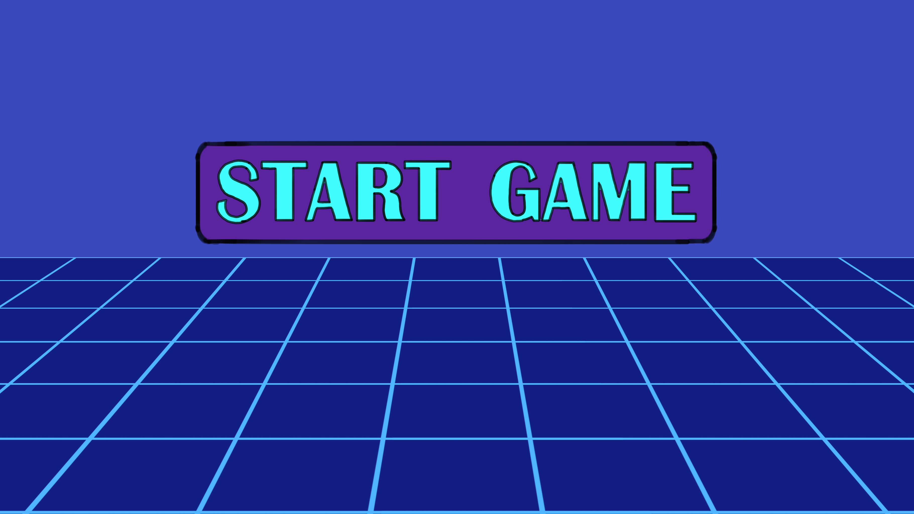
*"Start Game" button – a simple click triggers a series of underlying programming commands.*

- *InitializeGame()*
- *CreatePlayerCharacter()*
- *SetGameParameters()*
- *LoadGameLevels()*
- *SpawnEnemiesAndTriggers()*
- *StartAudio()*
- *DisplayGameInterface()*

And these commands will likely call many other commands that take care of the specifics. For example, *displayGameInterface* might call

- *DisplayHealthBar()*
- *DisplayInventory()*
- *DisplayQuestLog()*
- *DisplayMap()*
- *DisplayScoreboard()*

It's evident that a lot is going on beneath the GUI. Just think about it. What we see as "Start Game" is actually a long list of subprocesses. While everyday users don't need to know all these intricate details, programmers working on games or other apps must break things down into their smallest components. And that's where the terminal comes in.

The terminal operates at a more fundamental level, granting direct access to the operating system's underlying command-line interface (CLI). It's like a secret door that bypasses the graphical user interface altogether. You can do everything you do with a GUI using the terminal, but not everything you can do with the terminal is possible through a GUI. That's because the GUI is written based on the commands, and not all commands are necessarily represented in the GUI.

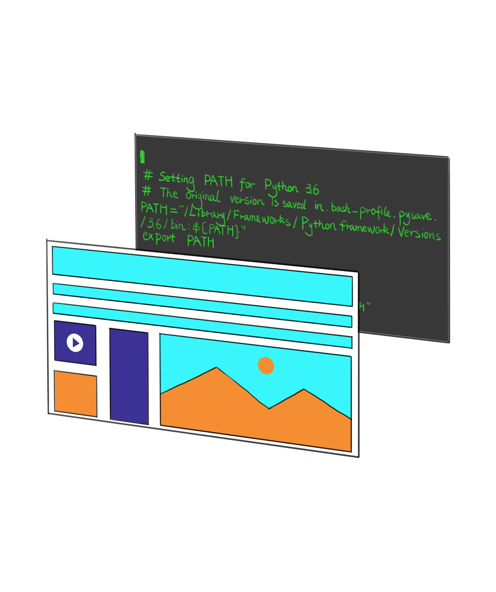
*The GUI's sleek design masks the complex code within the terminal.*

That's why programmers and IT professionals rely on the terminal. It offers unparalleled control and functionality. While GUIs simplify user interactions, programmers might not create or develop them for certain specialized technologies or applications. Nobody bothers to create the GUI-equivalent of tools used by programmers and IT professionals. Why? Well, developing a GUI takes extra effort, and programmers must write lots of code to erect a GUI-equivalent of a program. And the assumption is that since tech-savvy folks like programmers are capable of using the terminal, then they should just use the terminal. No need for a GUI-equivalent.

This explanation might make it seem like programmers force us to use the terminal because there is no GUI-equivalent, but the truth is that the CLI offers way more functionality than most of its GUI counterparts.

The terminal gives you direct access to the building blocks of a computer's operations. You can run powerful commands, automate tasks, manage files, configure software, and troubleshoot like a pro. By diving into the terminal, programmers and IT professionals gain a deeper understanding of computers and unlock their full potential in the world of technology.

### Some concrete examples

Imagine you are building a website and want to configure the server settings for optimal performance. The terminal becomes invaluable in this scenario. You can access the server through the terminal and use specific commands to improve the website's speed, security, and functionality.

Now consider the example of configuring network devices in a large organization. Network engineers often rely on the terminal to access these devices and execute commands that optimize network performance, establish secure connections, and troubleshoot issues.

Another field where the terminal shines is cybersecurity. Security analysts use various terminal-based tools to detect and investigate potential threats. They can run commands to scan systems, analyze log files, and monitor network traffic, allowing them to identify vulnerabilities and take necessary actions to protect sensitive information.

Finally, the terminal is also crucial in the field of robotics. Even though we sometimes see young kids "programming" robots within their school curriculum, they often do it using a GUI. These interfaces often feature drag-and-drop functionality and simplified coding blocks that allow students to create basic robot behaviors without delving into the complexities of coding. Transitioning to the terminal becomes essential as students advance in their robotics journey. It allows them to dive deeper into coding, write precise and customized algorithms, and gain a deeper understanding of the mechanics behind their robot's operations.

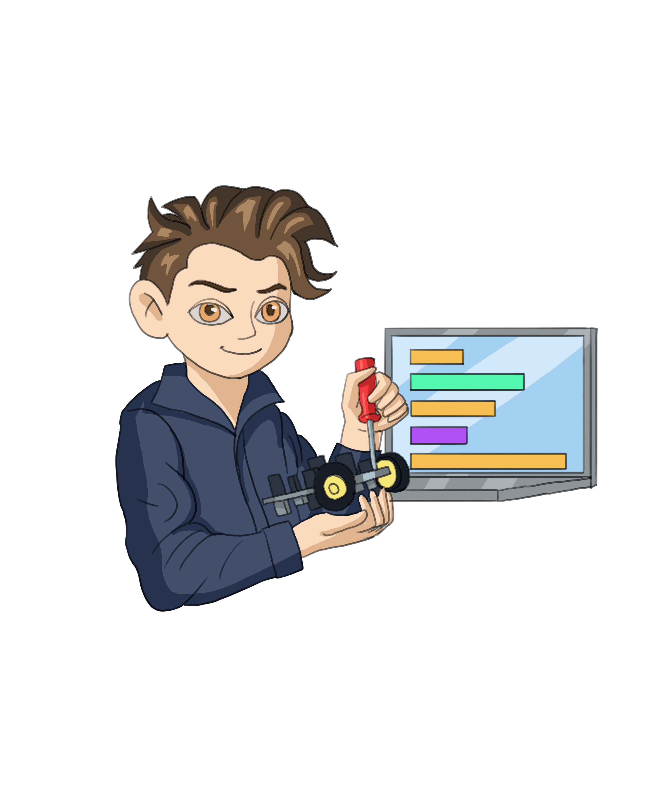
*Evolving robotics skills from basic interfaces to complex coding.*

So whatever your interests, the terminal is a crucial tool for programmers and IT professionals. It provides direct access to the underlying command-line interface, allowing for precise control, automation, and efficient workflows. Using the terminal also allows users to gain a deeper understanding of their computer's operations, enhancing their technical skills.

### Fundamentals

In this section, we will lay the groundwork for a solid foundation by delving into the essential components of the terminal.

#### Terminal-emulator

The terminal used to be an entire device on its own (a display with a keyboard), separate from the mainframe computer. Today, we use software called emulators that replicate the functionality of old-school terminals. But although we technically use terminal-emulators, we simply call the program a terminal.

#### Unix

As you delve deeper into the world of computers, you will inevitably encounter the term "Unix." Developed in the 1970s by Ken Thompson and Dennis Ritchie (the latter having created the C programming language for this purpose), Unix was a pioneering operating system that revolutionized the computing landscape. Unix played a significant role in popularizing the use of text-based commands as a primary means of interacting with a computer, and it served as the foundation for many subsequent operating systems, including the widely used Linux.

> To learn more about the history of Unix, read [The Story Behind the Development of the Unix Operating System](https://www.opensourceforu.com/2019/06/the-story-behind-the-development-of-the-unix-operating-system/).

#### Linux

Linux, a widely-used Unix-like operating system, was developed by Linus Torvalds in the early 1990s. Being open-source, Linux allows users to freely access, modify, and distribute its source code.

> **Note:** "Source code" refers to the original, human-readable version of the code that programmers write. "Code" can sometimes be used more broadly to refer to compiled or executable programs, while "source code" indicates the raw code developers work with before it's translated into machine-readable instructions.

You'll be surprised to learn that Linux is used everywhere. While the average consumer knows only of Windows and macOS computers, companies across various sectors have embraced Linux's versatility, stability, and cost-effectiveness. They deploy it in applications ranging from web servers and cloud computing to scientific research, embedded systems, and even space exploration.

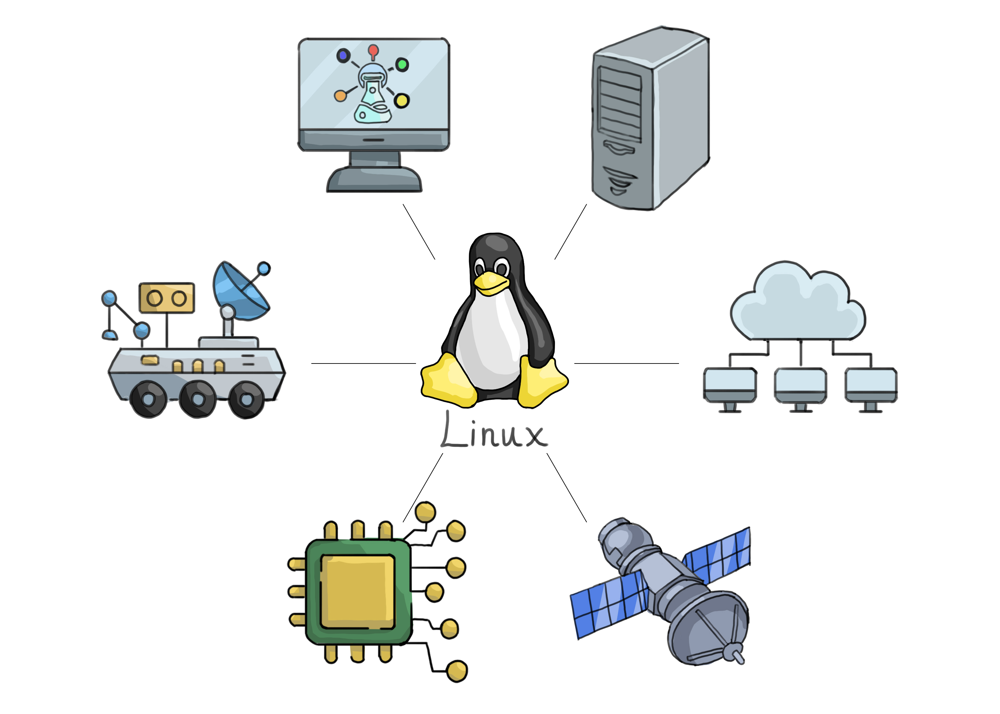
*Various industries utilize Linux, highlighting its widespread adoption.*

As you delve deeper into the technology realm, you'll likely encounter Linux, which places significant emphasis on executing text-based commands through the terminal.

> **Fun fact:** Linux powers 96.3% of the world's top web servers. [(Source)](https://www.enterpriseappstoday.com/stats/linux-statistics.html#:~:text=Linux%20is%20used%20to%20power,Linus%20operating%20system%20is%20run)

#### Kernel

In the [Computer Fundamentals, Software and Hardware](../computer-fundamentals/software-and-hardware.md) section, I mentioned that the operating system is what sits between the hardware components of a computer and the software applications.

In general, this is true, however the operating system is large and has many components. One of its components is called the kernel.

In line with its English definition, the kernel is the operating system's core. Windows has one, macOS has one, and so too does Linux. All the tasks attributed to the operating system are, in fact, carried out specifically by the kernel.

#### Shell

As it turns out, we can have direct access to the kernel of an operating system. And that is thanks to the outermost layer of the operating system, known as the shell.

The shell takes in commands and interprets them. For that reason, it can be called a "command-line interpreter" or "command language interpreter" (which also abbreviates to "CLI", just like the "command-line interface", showing how these two are typically used interchangeably). The shell is a program that translates your typed commands into instructions that the kernel can understand and execute. It sits between the user and the kernel of the operating system.

But wait, wasn't that the role of the terminal?

Not exactly. The terminal does sit between the user and the operating system. However, it is simply an interface, a place where the user can write their commands. The terminal only knows how to accept input from the keyboard and display output onto the screen. The terminal itself does not know what to do with the provided input. And that is where the shell comes in.

> The terminal is a program application that provides a graphical user interface (GUI) for you to interact with the shell. The shell is the one that interprets what you wrote and executes the commands. Hence why it is called the Command-Line Interpreter.

When you enter a command in the terminal and hit enter, the terminal forwards your input to the shell. The shell then reads and processes these commands, communicating with the kernel to carry out your requests. The kernel then performs the necessary tasks, such as managing memory, accessing files, or running processes, based on the instructions provided by the shell.

The terminal and the shell are often used interchangeably, so don't get too caught up on the definitions when reading about it online.

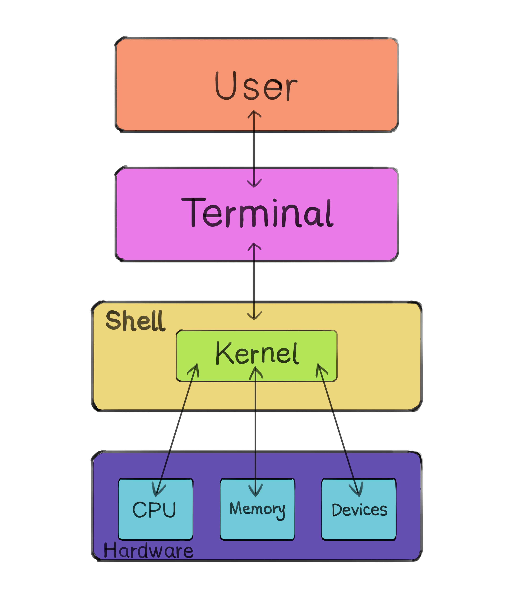
*The shell interprets user commands and communicates directly with the kernel, facilitating user interaction with the operating system.*

Since the shell is just a program that interprets commands, many variations have been created. The default shell on most Linux and older macOS systems is called the GNU Bash, or just Bash. Newer macOS users use Zsh ("Z shell"), and Windows machines use the Command shell (also known as "cmd") and PowerShell.

#### Review of the working directory

I want to mention this topic again because it is so important. The working directory is important when working with files because it determines the context in which file operations occur. When you create, modify, or access a file without specifying a specific file path, the operating system assumes that the file is located within the working directory.

So, if you are in the

```text
Locker > Physics > Quizzes 
```

folder, and you enter a command that translates to "create a file called 'quiz8.txt'", it will create it in your working directory, i.e. Locker/Physics/Quizzes/. If you do not specify where you want the command to execute, then it will, by default, execute in the working directory.

#### File system navigation

Moving around the file system is a fundamental skill in the terminal. You will need to work with files from different directories, and knowing how to navigate efficiently will save you time and effort.

For macOS and Linux users, you can view the "Basic Navigation" of [this resource for specific commands](https://www.redhat.com/sysadmin/navigating-linux-filesystem), as well as [this one](https://www.digitalocean.com/community/tutorials/basic-linux-navigation-and-file-management#navigation-and-exploration).

For Windows users, you can view [this resource for specific commands](https://riptutorial.com/cmd/example/8646/navigating-in-cmd), as well as [this article](https://www.howtogeek.com/659411/how-to-change-directories-in-command-prompt-on-windows-10/).

#### File manipulation

The terminal enables us to work with files efficiently.

For macOS and Linux users, you can view the "File Manipulation" of [this resource](https://www.digitalocean.com/community/tutorials/basic-linux-navigation-and-file-management#file-and-directory-manipulation), as well as [this one](https://www.scaler.com/topics/linux-file-commands/).

For Windows users, you can review some navigation commands as well as learn about file manipulation in [this article](https://www.it.uc3m.es/pbasanta/asng/course_notes/linux_managefiles_en.html), as well as [this one](https://bebi103a.github.io/recitations/01/working_with_files.html).

#### Working with text

Working with text in the terminal opens up a world of possibilities. It allows you to manipulate, search, and transform text effortlessly.

For macOS and Linux users, you can view [this resource](https://www.makeuseof.com/best-linux-text-manipulation-commands/), as well as [this resource](https://learnbyexample.gitbooks.io/linux-command-line/content/Text_Processing.html).

For Windows users, you can read [this resource](https://www.ibm.com/docs/en/aix/7.1?topic=files-administering).

#### Understanding relative versus absolute path

In the [Computer Fundamentals, Software and Hardware](../computer-fundamentals/software-and-hardware.md) section, I talked about the meaning of a file path. There, I described what is known as "absolute path", i.e. the path it takes to get to a file starting from the root folder, or in the case of the analogy, the locker.

However, "relative paths" are equally essential. They define a file or directory's location concerning the current working directory. Instead of tracing back to the system's root, they start from where you are right now in the file system, i.e. the working directory.

For instance, if you're in the Locker/Physics/Quizzes directory, the relative path to a "Homework" folder inside it would just be "Go up to Physics" -> "Down to Homework", whereas its absolute path might be Root -> Science -> Physics -> Homework.


*On the left, arrows show an absolute path from the root to a target folder. On the right, arrows depict a relative path from a current directory to the target folder.*

To better understand the difference, as well as learn some more about how to navigate the file system, check out [this article](https://www.redhat.com/sysadmin/linux-path-absolute-relative).

#### I/O redirection

When we enter a command into the terminal using the keyboard, the input is text (also known as "standard input"). After executing the command, we often receive output, typically displayed as text in the terminal (known as "standard output"). Examples of commands that follow this pattern include `ls`, `cat`, `pwd`, and others.

In addition to receiving output in the terminal, we can use I/O redirection to manipulate how commands process data. Let's say you want to take the output of one command and use it as input for another command. This is where pipes come into play. Pipes are represented by the `|` symbol and allow us to connect multiple commands, creating a powerful chain of actions.


*Ingredients combine into a pizza, then to the oven, illustrating command chaining, a.k.a. piping.*

See examples of how to use pipes [in this article](https://www.computernetworkingnotes.com/linux-tutorials/pipes-in-linux-explained.html).

It is also possible to redirect an output into a file rather than onto the terminal using the `>` operator. Learn more about it [in this article](https://learning.lpi.org/en/learning-materials/010-160/3/3.2/3.2_01/#:~:text=To%20redirect%20standard%20output%20to,will%20overwrite%20the%20existing%20file.).

### Conclusion

The terminal is an immensely powerful tool, offering a direct line of communication to the core of your operating system. As you become more comfortable using it, you'll discover its potential to streamline tasks, automate repetitive actions, and give you a richer understanding of how computers work.

## Git

Imagine investing months, or even years, in developing a remarkable app, only to one day lose your laptop and, thus, your work. Despite such potential setbacks, how do thousands of programmers still manage to collaborate on a single project and stay organized? Now that you know about the terminal, we can discuss the powerful tool called **Git**.

### Importance

Suppose you're working on a robotics project, with all your code neatly stored in a "RoboticsProject" folder. Given the complexities of coding and the potential for unexpected outcomes, you've adopted a prudent approach. Each time you reach a functional milestone, you save that version in the "RoboticsProject" folder, ensuring you always have a reliable backup to revert to if needed.

Suppose you decide to enhance your robot with an arm capable of grasping and lifting balls. To test this new functionality while preserving the original design, you could duplicate the "RoboticsProject" folder and name it "RoboticsProject_v2".


*To the left, we have the version of the project that is stable and works. To the right is an experimental version of the robot, with an arm mechanism still being developed and tested.*

Why go through this trouble? Well, this duplicate serves as a playground where you can freely experiment without fear of damaging your working code. If your attempts in "RoboticsProject_v2" lead to chaos, no worries because your original code in "RoboticsProject" remains intact.

Suppose "RoboticsProject_v2" turns out to be a success, and your new arm mechanism works flawlessly. At this point, "RoboticsProject_v2" becomes your main project, incorporating the new feature.

This approach significantly improves your workflow compared to what many novice programmers do. However, there's a catch. Managing code becomes more complex when multiple people collaborate on the same project. Imagine Alice is enhancing the lift feature while Bob is simultaneously working on the ball grasping mechanism. Once they both complete their features, which of the two folders will be the new main code? How are we going to merge the two codebases together? Is Alice going to send her version, notify Bob of the changes that she's made, and have Bob manually copy and paste the changes into his version, which will eventually become the main version?

Too complicated.

To address such challenges, programmers often rely on version control systems like Git. These systems allow collaborative work while keeping everyone's changes organized and manageable. So, while the "duplicate and experiment" technique is great for personal projects, embracing version control tools like Git takes your coding journey to a whole new level, especially for team collaborations.

### Fundamentals

#### Version control systems (VCS)

Version Control Systems are tools that keep track of changes to code or other collections of files or folders. In other words, they keep track of the history of changes to some set of documents.

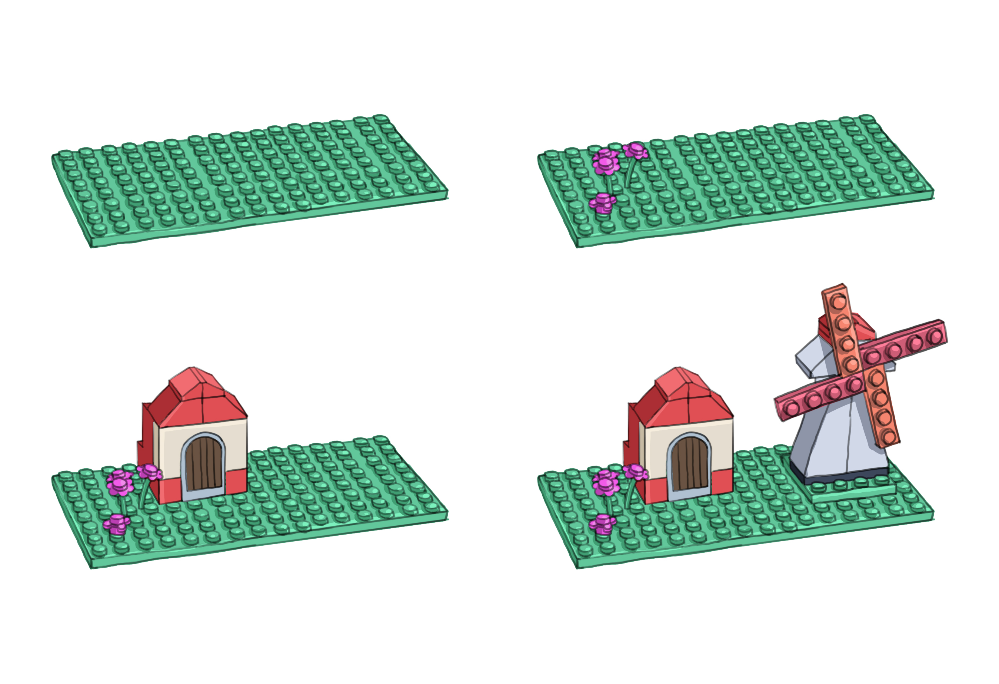
*A set of snapshots capturing how a project builds up.*

Version Control Systems track changes to a folder and its contents in a series of snapshots. So, if you are working on your code, you can take a snapshot of the entire state of your project folder at any time, and with time, you will have multiple of these snapshots.

Version Control Systems also keep track of some extra information, or "metadata", along with the actual changes to the content. This makes it possible to know who authored a particular change to a specific file, when was this change made, and what message was left with the snapshot.

There are several Version Control Systems out there, such as Subversion (SVN) and Mercurial, but Git has become the de facto standard for version control. Here, we will talk about the concepts with Git in mind.

#### Setting up a repository

At the heart of every Git project is the repository, often referred to as a "repo" (pronounced "ree-pow"). A Git repository is a special folder for your project where every change, every decision, and every version of your project resides.

I'll repeat this because it is so important: a Git repo is not just a place to keep your files; it also keeps track of all your changes so you can see how your project has changed over time.

#### **Local repository**

You have your computer in front of you. On this computer, you have folders and files. One of these folders is your "RoboticsProject" folder. This is where you are programming your robot. This folder, with its files and sub-folders, is known as your working directory. This is where you are writing your project.

With just one command, you can turn this folder into a Git repository. And since it is stored locally on your computer, it will be known as a "local repository".

> In computer terms, "local" means something is on your own computer or in your immediate network. For example, "localhost" refers to your own computer, particularly when you're running a program or service on it. A "local network" is a group of computers or devices that are physically close, like the devices in your home. This is in contrast to "remote," which means it's located off-site or somewhere else on the internet.

This local repository contains not only your project files but also a history of changes, authorship, and notes associated with those changes. This point is critical. Don't think of your repository as simply the current state of your project because that's what the working directory is. Your local repository is the history of your project, alongside the metadata of each snapshot.

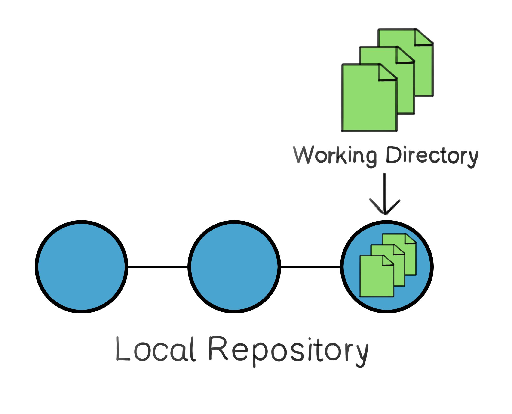
*Three snapshots stored on the local repository, with the latest one mirroring the current state of the working directory.*

#### **Remote repository**

Local repositories are fantastic for individual work, but the true power of Git shines when collaborating. Remote repositories are hosted on the internet and act as a hub where teams can share, collaborate, and synchronize their codebase.

Imagine that you want to share your "RoboticsProject" folder with friends so they can help you with the programming. Instead of using a USB drive or some messaging app to share the work, you can use a remote repository that will host your project for free on the internet.

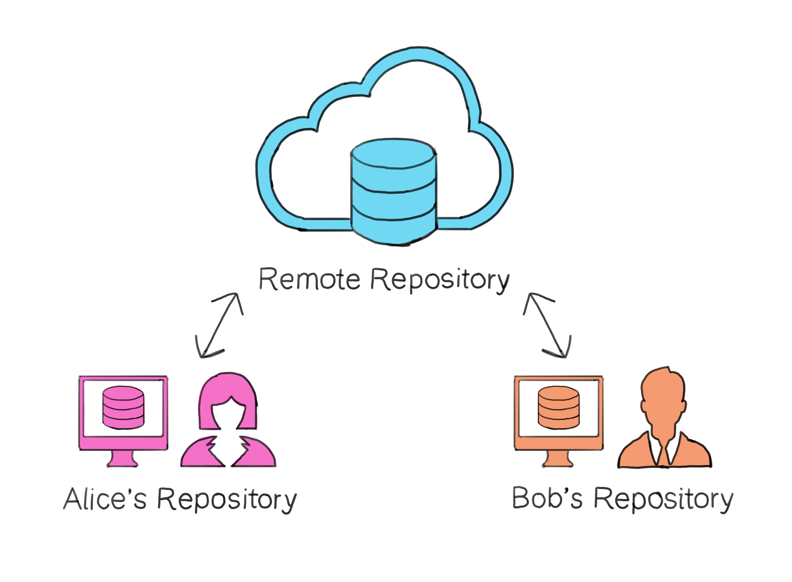
*A centralized remote repository on the internet, with Alice and Bob syncing their individual local repositories to it.*

Putting your project in a remote repository is like creating a meeting place for you and your friends to share, collaborate, and synchronize your code. You can all work on the same project from your computers, and the remote repository will help keep track of everyone's changes.

> Hosting means storing your website or project on a computer called a server, which is connected to the internet and makes your content accessible to others. When you hear about web hosting, think of it as renting space on one of these servers to store your website. Similarly, platforms like GitHub, GitLab, and Bitbucket host your code repositories on their servers so others can access and collaborate on them.

### Staging changes

I already mentioned that you can take a snapshot of the entire state of your project folder at any time. That will be discussed in the next section, "Committing Changes".

In Git, before you take a snapshot of your project's current state, you need to decide which changes you want to include in that snapshot. This step is called staging. Git provides a particular area, called the staging area, where you can select and organize the changes you want to include in your snapshot.

Staging is like preparing a set of items you want to pack into a box. You pick out the items you need and set them aside so you're ready to pack them up when the time comes.

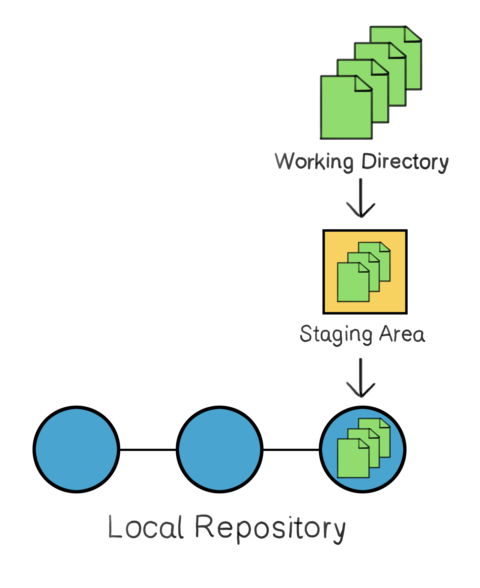
*Changes from the working directory are first selected and organized in the staging area before being saved as a snapshot in the repository.*

For simple projects, you'll usually stage all your changes at once. However, for more advanced projects, you might want to be more selective about which changes you stage together, as it is an intermediary step between making changes to your project and taking a snapshot of those changes. While it might seem like an extra step at first, it becomes a powerful tool for organizing your project as it grows in complexity.

> There may be certain files you don't want to be tracked and added to your repository. For example, you might want to exclude log files, which are automatically generated records of events in a software application. They can be large and change frequently, so it's typically not helpful to track them in your Git repository. [Read this](https://www.bmc.com/blogs/gitignore/) to learn how to ignore files.

### Committing changes

When we talk about "taking a snapshot" of your project, we're actually referring to a process known as "committing" in Git. Once you've staged your changes, you're ready to commit them. In other words, it's time to save a snapshot of your current progress.

Think of committing in Git as creating a checkpoint in a video game. It's a saved state that you can always return to later if needed.

> Remember that committing does more than bookmark your progress. Every commit carries the author's name, the date, and a message explaining the 'why' behind the changes.

As you work on your code, you'll find yourself staging and committing changes regularly. This process results in a series of snapshots, each representing a specific stage of your project. If we were to visualize these snapshots, they would form a timeline where each snapshot links back to the one before it. This timeline preserves the chronological order of your changes and helps you see the project's entire history at a glance.

So, if you realize that you made a mistake in your code and want to backtrack to a previous commit, how do you do it? Does each commit have a number associated with it? Can I just say "I want to go to commit #3"? Actually, yes, that's basically correct.

Each commit does have a unique identifier, but instead of being some arbitrary number like 1, 2, or 3, it's a long, funky-looking string generated through a process called SHA-1. Imagine this: You have a magical machine that turns any document, no matter how big, into a unique combination of letters and numbers. To be more precise, this is a 40-character fingerprint derived from your changes and associated metadata. This ensures each commit is distinct and allows for precise tracking. In Git, every time you save your progress (or "commit"), your work goes through this machine, and out comes a special code. This code, or "hash", is like a unique name tag for that specific moment in your project. So, when you want to revisit a past moment, you just need to reference its unique hash ID!

And how do you know at which point you are at in this series of snapshots? Sure, you can say "I want to go to commit 4f5h...359b", but what keeps track of your current position? That is, what keeps track of which snapshot your working directory is reflecting? 

Enter the HEAD pointer.

The HEAD is a pointer that tells you where you are in the repository. It usually points to the latest commit in the branch you're currently working on. If you switch branches (which we will see later) or retract a previous commit, the HEAD will move accordingly, as shown in the illustration below.


*Four snapshots in a Git repository, each labeled with a unique hash ID. The 'HEAD' pointer indicates the current position in the project's timeline, while 'MAIN' marks the most recent commit.*

### Bringing it all together

At this point, we've explored various components and stages of Git. Let's take a moment to see how everything comes together to form a streamlined workflow for developers. Specifically, let's focus on the interaction between the working directory, staging area and local repository.

> **Important:** Please note that all of this is happening locally on the user's computer. We are not yet interacting with a remote repository and dealing with other people working on the same project. In order to turn your regular folder into a Git repository, read [2.1 Git Basics - Getting a Git Repository](https://git-scm.com/book/en/v2/Git-Basics-Getting-a-Git-Repository).

1. Working Directory: This is where you'll be doing most of your work. It's where you write, edit, and delete your project files. When you have made some changes to your files that you're satisfied with, you move on to the next step: staging your changes.

    Note that whichever commit the HEAD pointer points to is the version of the project that you will see in front of you in your working directory.

2. Staging Area: Before committing changes to the local repository, you must decide which changes you want to include in that snapshot. This step is called staging. The staging area is a sort of buffer that holds the changes you want to commit. You select and organize the changes here, ensuring you have a set of related changes ready to be committed.

3. Committing to the Local Repository: Once you have staged your changes, you commit them to your local repository. This step involves saving a snapshot of your project in its current state to the repository. Remember, each commit captures a moment in your project's history. When you commit, you provide a message that briefly describes your changes. This message becomes part of your project's history, helping you and your collaborators understand why each change was made.


*Workflow diagram showcasing the sequence of Git operations: Changes are made in the 'Working Directory', prepared in the 'Staging Area', and then saved as a snapshot in the 'Local Repository'.*

> **Resources:** To learn more about the specific commands to use, read [2.2 Recording Changes to the Repository](https://git-scm.com/book/en/v2/Git-Basics-Recording-Changes-to-the-Repository), as well as sections [2.3 Viewing the Commit History](https://git-scm.com/book/en/v2/Git-Basics-Viewing-the-Commit-History) and [2.4 Undoing Things](https://git-scm.com/book/en/v2/Git-Basics-Undoing-Things).

### Branching

Branching is one of the powerful features of Git. Imagine you're working on the "RoboticsProject" folder with your team and want to try a new feature for the arm mechanism. Instead of making changes directly to the main project, you create a "branch" - a parallel version of your project where you can experiment without affecting the original code. In Git, the main branch is often called the "main" branch (previously called "master"), and it's the version of your project that's considered stable and ready for production.

When you create a new branch, it's like you're taking a snapshot of the main branch at that point in time. You can make changes, add new files, and even delete files in the new branch without affecting the main branch. This allows you to experiment, try new features, or fix bugs in a safe environment.


*The main branch serves as the stable foundation, while two team members create branches to independently experiment with new features.*

If you are working alone, a branch enables you to try something out and easily revert your code back to the beginning simply by switching back to the main branch. When working with others, if everyone works in their own branch, they can save work on their part in isolation without affecting their teammates.

> **Resources:** For specific commands around branching, [read this](https://www.atlassian.com/git/tutorials/using-branches). Furthermore, you may want to switch between different branches. To do that, [read this](https://www.atlassian.com/git/tutorials/using-branches/git-checkout).

### Merging

After working on your feature branch and testing the new arm mechanism code, you're ready to incorporate it into the main project. This process is called "merging." By merging your feature branch into the main branch, you're integrating the changes you made in the feature branch back into the main project. This way, your team can benefit from the new features or fixes you've added.

Merging is taking the separate lines of development created by branching and joining them back together. When you merge two branches, Git will try to automatically combine the changes. If the branches have diverged significantly, you may need to help Git by resolving any conflicts that arise.

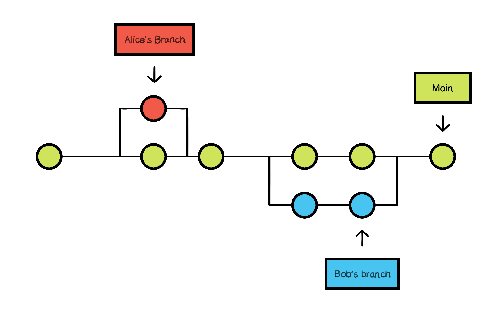
*After successfully completing their respective features, Alice and Bob merge their work back into the main branch.*

> **Resource:** For specific commands around merging, [read this](https://www.atlassian.com/git/tutorials/using-branches/git-merge).

I encourage you to practice your Git command skills with [this Git visualizing tool](http://onlywei.github.io/explain-git-with-d3/#freeplay). Note that the staging step is omitted in this tool so that you can commit directly.

### Collaborating with remote repositories

When working with a team on a project, you'll often have a central version of the project hosted online. This is known as a "remote" repository. You and your teammates can each have your own "local" copy of the repository on your computers, where you make changes and test them.

To get your own local copy of the remote repository, you "clone" it. Cloning creates an exact copy of the entire repository on your computer, including all the code, branches, and commit history.

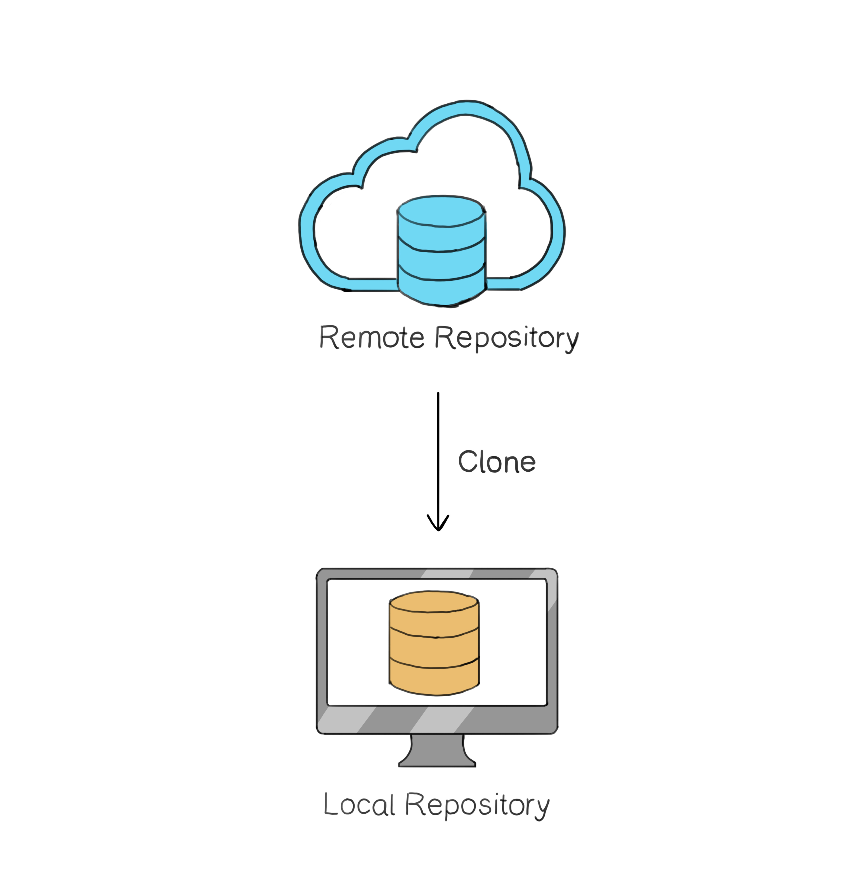
*Cloning creates an exact local copy of the remote repository.*

Once you have a local copy, you can create branches, make changes, and commit them just like in any other Git repository. While your local repository maintains this history of commits, these are local to your computer. To share this history and the current state with others, one must synchronize the local repository with the remote one.


*To synchronize changes, you push updates from your local repository to the remote and pull the latest changes from the remote back to your local repository.*

However, it is crucial to note that you cannot directly push code from your working copy to the remote site. Similarly, you cannot directly push your code from the staging area to the remote site. The remote site is only connected to the local repository. When you're ready to share your changes with your team, you "push" your commits from the local repository to the remote repository. Conversely, to get the latest updates from your team, you "pull" the changes from the remote repository into your local copy.

<!-- When working with remote repositories, there's an important concept called "upstream tracking." Imagine you've created a feature branch and pushed it to the remote repository. The next time you want to push changes to the same branch, you don't need to specify where to push them. Git remembers the branch's location in the remote repository, making it easier to share your changes. This is what's referred to as "upstream tracking." -->


*Changes are pushed to the remote repository from the local one. Meanwhile, updates from the remote repository are pulled both into the local repository and the working directory.*

Remember, collaborating with others involves not only sharing your changes but also keeping up with their work. Regularly pulling updates from the remote repository ensures you're working with the project's latest version and helps prevent conflicts when merging.

> **Resource:** Read [this article](https://www.javatpoint.com/git-remote) to learn about the Git remote-related commands.

### Resolving conflicts

Let's imagine a scenario. You're working on the "RoboticsProject" folder on your computer, programming the launch mechanism. At the same time, your friend is working on the same file, making some minor tweaks to the code. You both finish your parts and try to merge your changes. Boom! Conflict. Why? Because you both made edits to the same line of code.

So, what's this "conflict"? When you and your teammates are working on the same code and make different changes to the same spot, Git gets a bit confused. It's like trying to listen to two people talk at once and not knowing who to focus on. Git needs you to step in and decide which change should stay.

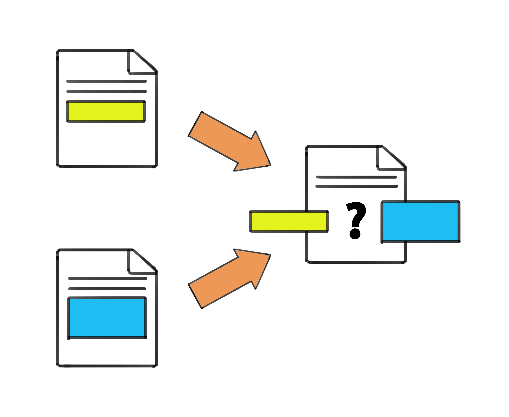
*Two developers editing the same code line, leading to a conflict that needs a decision on which change to keep.*

When this happens, Git shows both changes, delimited by <, =, and > markers. At this point, you have to edit the file and decide which changes to keep, which to discard, or perhaps blend the two changes together. After "resolving" the conflict, stage the file, and then commit (leave a helpful message explaining the reasoning behind the change) and push your harmonized version to the remote repository.

> **Resource:** Read [this article](https://www.freecodecamp.org/news/how-to-fix-merge-conflicts-in-git/) to view how to resolve a Git conflict.

While a Git conflict may seem intimidating at first, it's usually simple to solve as long as you are communicating with your friend. Discussing the reasons behind each change can help both of you understand the broader perspective and decide on the best solution. This collaborative resolution ensures the code works as intended and fosters a harmonious team dynamic. Remember, in collaborative projects, communication is as crucial as coding prowess.

<!-- ### Enhancing collaboration
[//]: # "Talk about the concept of pull requests and code reviews."  -->

### Best practices and etiquette

Navigating the realm of Git collaboration can be a smooth journey if we all follow certain guidelines. Whether you're a newbie or a seasoned developer, these practices will enhance your team dynamics:

1. Commit Messages: Always write clear and concise commit messages. A good message describes the change and its purpose, providing context for your team.

2. Small Commits: It's easier to understand and review small, focused commits than large ones. Aim to commit one logical change at a time. Don't cram all of your local changes into the upcoming commit. This is where the staging area can become useful, as it will allow you to select specific files and even parts of those files to include in the next commit.

3. Branching Out: Create a new branch when experimenting or adding a new feature. This keeps the main codebase stable and allows for isolated testing and development.

4. Consistency: Adopt a consistent branch naming convention and clarity in the branch's purpose. Examples of branch names are *launch-mechanism*, *sensor-integration*, and *battery-optimization*.

5. Regular Updates: Pull changes from the main branch regularly. This reduces the likelihood of conflicts and keeps your local copy up to date.

6. Resolving Conflicts: If there's a merge conflict, ensure you understand both sides of the conflict before resolving it. When in doubt, consult with your colleagues.

7. Test Before Pushing: Always test your changes locally before pushing them to the remote repository. This helps in catching bugs early.

8. Stay Informed: Regularly participate in team meetings or discussions related to the project. Being proactive ensures you're aligned with the team's goals.

By cultivating these habits, you're not just being a good team player but also contributing to a healthy, productive, and friendly coding environment.

## Search Engine

They say that Google is a programmer's best friend.  With a few keywords and a click of a button, a world of knowledge opens up at the palm of our hands. Whether it's debugging an error, exploring new libraries, or discovering best practices, programmers can navigate the vast realm of knowledge through a **search engine**.

### Importance

In the world of programming, one thing remains certain: programmers, even those with decades of experience, will face hurdles, encounter challenges, and have moments of confusion.

This is especially important for beginners, because it could be very discouraging to not be able to move forward with a project because of some error. It is quite common for beginners to get stuck, not know how or even who to ask for help, and simply abandon on their learning journey.

Even more experienced programmers ask for help. Programming is a dynamic field that constantly evolves with technology. Some programming languages that were once considered cutting-edge have evolved, while new ones have emerged. As a result, programmers often find themselves working on diverse projects with varying technical requirements. While their experience serves as a solid foundation, they may still encounter unfamiliar details or bugs.

The key to overcoming these obstacles is to be resourceful and skilled in the art of searching for answers effectively. The internet has almost all the answers, but you need to be able to extract them. This is where the power of a search engine comes into play.

## Fundamentals

We all wish that computers could just read our minds and give us the exact solution to our problem, in the exact context that we need it in. However, past the most rudimentary of programming questions, things aren't always that easy. Searching is somewhat of an art, and it's not always intuitive.

While there are alternative search engines such as Bing, Yahoo, DuckDuckGo, we will stick with the Google search engine, as it is the most widely used, notably among programmers. However, the advice provided will be relevant for all search engines.


*A browser window displaying the homepage of the Google search engine.*

### How Google Search works

The internet is a global network of interconnected computers and servers. It is a vast infrastructure that allows various devices and networks to communicate with each other using a common set of rules known as protocols.

One of the subsets of the internet is called the World Wide Web, or simply "web" for short. The web refers to a collection of interconnected websites and web pages that are accessible through the internet.

Google Search is a powerful tool that helps users navigate the vast landscape of the web to find relevant information. When you enter a query ("query" is a fancy word for "question") into Google's search bar and hit the search button, a complex and fascinating process is set in motion.

1. Crawling: Google uses specialized software known as "web crawlers" to systematically browse the web. These crawlers follow hyperlinks from one web page to another, collecting data about each page they visit. This process is known as "crawling."
2. Indexing: The data collected by the web crawlers is then indexed, which means it is organized and stored in Google's vast database. This index allows Google to quickly retrieve relevant information when a user performs a search.
3. Ranking: When you perform a search, Google's (secret) search algorithms come into play. These algorithms analyze the indexed data and consider numerous factors to determine the most relevant and useful results for your query. Google takes into account factors like the words used in your search, the freshness of the content, the quality of the web page, and the number of other websites linking to that page (known as PageRank).


*Google's search journey: Traversing the web, indexing content, and ranking for relevance.*

### When to google

The truth is that you can google anything, anytime you want. Google is never going to tell you "that was a dumb question". Once you start googling, you will notice that there have been many people before you who have had the same questions, and those questions are answered on the internet. However, here are some more specific cases when it is appropriate to google.

1. As someone learning a new programming language, googling can help you find tutorials, guides and online courses to expand your knowledge.
2. If you come across the use of a function in a tutorial, and would like to see more examples of that function being used, then googling for examples is a great idea.
3. When you compile or run your code, errors are inevitable, and copy-pasting the error message will often lead you to either a blog post solving the error, a discussion forum where others have faced the same issue and found solutions, or most commonly, a Q&A website such as Stack OverFlow. However, do not forget to read and try to understand the error message yourself before automatically copy-pasting it.
4. Just like when learning a new programming language, there may be a new library that you must use. Learn more about the library by googling it.

### How to google

Googling is an art. There is no one way to enter your query. I might ask it one way, and you might ask it slightly differently. And that's okay. But here are some general guidelines on how to do it.  

#### Be simple but precise

The important thing is to find a balance between concise and descriptive queries. You need to use the minimum number of words, but also give enough information for Google to understand what it needs to show you. Never add any information that is not important. Being too specific is not good either, as it will limit your search result and Google will return fewer quality examples of what you really want to know.

> If you want to know how to write a Hello World program in C, don't mention your operating system, your location, or your programming environment. All of these things are unrelated to the problem, and will negatively affect the search result as it will take the focus away from *"how to write a hello world program in c"*.

When it comes to simplifying your query, think of the resulting websites' titles and contents. Google will match your query with the website title and contents.

> Instead of writing *"I'm confused by when I should use semicolons in C"*, write *"semicolon use in c"*, or just simply *"semicolons in c"*. If Google shows results of semicolon use in regular English (for example), and didn't pick up the *"in c"* portion of the query, then specify: *"semicolon use in c programming language"*.

> **Note:** Google searches are case-insensitive, meaning it doesn't matter if you write *C* of *c*.

#### **Use autocompletion**

When you start typing words into the search bar, always pay attention to what Google is suggesting. It can help you complete your queries faster, but it can also better word a query for you, taking the guesswork of what to type away. This is a perfect feature to use when you have an idea of what you are looking for, but not sure how to phrase it.

#### **It's okay to be messy**

This is not a beauty contest. You do not get a prize for coming up with the nicest and cleanest way to ask a question. Sometimes, the perfect words just aren't coming into your mind, and that's okay. Use the English language as best you can to describe the problem.

> Let's say you know that there is a function that *prints out* the argument as a message onto the screen. So you can write *"function to print message in c"*. But what if you forgot the terms "function" and "print". Well, just simplify it into English: *"how to output onto the screen in c"*. Now what if you forgot the term "output"? Simplify the query further: *"how to write onto the screen in c"*.

Part of the programming journey is to go from using purely English terms, to using more technical and precise programming terms. As long as you read the results, learn more about the topic and get used to the correct terms, you are on the right path.

#### **When to check the second page**

Sometimes, you search a query, and Google gives results for a different topic with similar vocabulary. If that happens, don't go looking for your topic on the second or third page of Google. The first page was Google's best guess at what you asked for, so instead of looking for what you need, word your query differently.

The only time you should consider checking Google's second result's page is when Google is displaying the correct general topic, but the articles provided are missing some detailed information that you need. This rarely happens though if you were specific enough in the query.

#### **Don't just click and stay**

After entering their query, most people will automatically click on the first search result and just read that. What I like to do is skim through the search results' titles and snippets, and see how well they match my query. If they match, I typically open a few of them in separate tabs (by holding *ctrl/cmd* and clicking on the websites), and skim through them. If the websites all provide the same solution, then I will use it with confidence. If not, then I might dig a bit into the different solutions and learn about the differences.

#### Use matching operators

1. Using double quotes ("") around any term acts as an **inclusion operator** and will force Google to match it exactly. E.g. ***"html" "css" website development***
2. Using the minus symbol (-) before a word acts as an **exclusion operator** and will filter out any results containing that word. Use this when you are looking for a solution for something but, for one reason or another, you don't want to use some particularly popular tool; maybe it doesn't work on your system, maybe it's too bulky for your project, etc. E.g. rather than searching ***robotics programming without python***, which is going to give python-related results, search for  ***robotics programming -python***.
3. Using the asterisk (*) within a query acts as a **wildcard operator** and will be replaced with any word or phrase. E.g. you run your code, and receive an error message which contains your local directory (which will only be relevant to you). Instead searching for the entire error message, you could replace that section with an asterisk.

#### **Use date operators**

If you are typing ***"c programming tutorial"*** and are getting results from 2010, you may want to limit the search to more recent articles.

You can use the complete format of ***yyyy-mm-dd***, or just type in the year. For example, ***"c programming tutorial after:2020"***.

Similarly, you can use ***"before"*** to search for articles before a certain date.

#### **Honorable mention: Stack Overflow**

One website that you will commonly encounter through your google search results will be StackOverflow. Stack OverFlow is a question-and-answer website for programmers.

For beginners, Stack Overflow is an excellent place to learn from others' experiences and to gain insights into best practices. Reading through questions and answers related to topics you're interested in can provide valuable exposure to real-world coding scenarios.

### Veterans google differently

While experienced programmers do use Google a lot, there is a big difference in the way that they use it as opposed to how a complete beginner uses it. In the world of cybersecurity, there is this idea of a "script kiddie"; this is a person who uses existing code and copy-pastes his way through to whatever he wants to do. An experienced programmer will never simply take a piece of code and use it without fundamentally understanding what it does. They may do so to try to see if it works, but then they will try to understand it to potentially improve it and customize it.

So do not blindly follow or copy-paste any solutions you come across. Check to see if there are other avenues you could take. If you found a function that does what you need, learn more about how the function works; i.e. what arguments can it take, how will the result change if you give it different arguments, etc.

You must learn to carefully evaluate solutions you find online. Because at the end of the day, it's just people writing them. And people can also be faulty, or not provide the full picture. And this is where critical thinking comes into play.

## Code Editor

Have you ever wondered where programmers code? On their computers, sure. But do they open Microsoft Word? Do they open their browser and go to some special website where they can code? Programmers use a dedicated software tool designed specifically for coding: the **code editor**.

### Importance

In the early days of computing, programming was done using punch cards. Each card represented a line of code, and programmers had to feed a stack of these cards into a machine to run a program. This method was tedious and error-prone, as a single misplaced hole in a card meant the whole stack might be rendered useless.

As computers evolved and became more interactive, the need for a more efficient way to program them became evident. This led to the development of the first code editors. These tools were basic, offering simple environments for writing and editing text. Most importantly, these tools allowed programmers to easily correct errors with a simple backspace and to save their work electronically.

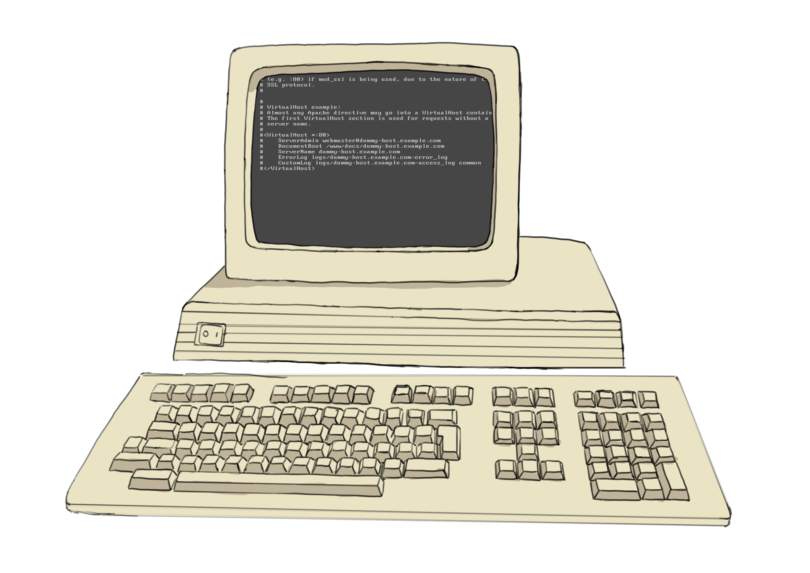
*A VT220 computer terminal, representing the kind of early hardware interfaces through which programmers interacted with computers in the 1980s.*

At the end of the day, writing code is really just typing text. This means, in theory, you could use anything from Google Docs to Microsoft Word for this task. However, as you delve deeper into programming, you'll understand the need for tools tailored specifically for the job, as they will make the coding process faster, more efficient, and less error-prone.

> **Fun fact:** In computing, we often refer to programming errors as "bugs." The term "bug" actually has a fascinating origin. Back in 1947, a moth found its way into one of the components of the Mark II computer at Harvard University. When the team, led by Grace Hopper, discovered it, they commented that they were "debugging" the system. That's how we got the term "debugging." So, a "bug" refers to an error or flaw in software that produces unexpected results, and "debugging" is the process of finding and fixing these issues to ensure the program works correctly.

### Fundamentals

Different code editors cater to different needs and are popular in different fields. Let's look at some of the popular ones.

#### Command-line editors

The first code editors started to appear in the 1970s. Since the mouse only became mainstream with the Apple Macintosh in 1984, the first code editors were keyboard-based. One of the pioneers was vi, released in 1976. To this day, it is a standard tool on many Linux machines.

In the same year, Emacs emerged as another influential editor. Characterized by its extensibility and customizability, Emacs went beyond text editing. With some customization, it transformed into an environment where one could use a debugger, email, browse the web, play music, and more - all without leaving the editor. This gave it a unique edge and garnered a dedicated user base.

In 1991, Vim (Vi IMproved) was released. Vim is an enhanced version of vi, bringing along more features and capabilities. Editors like Vim were built for efficiency, allowing users to navigate and edit files directly from the command line using keyboard shortcuts.

In the modern era, there's still a dedicated group of programmers who swear by such minimalist tools (notably Vim, Neovim, Nano and Emacs) for their unmatched speed and adaptability. Operating solely within the terminal, they don't have flashy visuals. However, there's a caveat: mastering them can be a challenge. A steep learning curve is associated with memorizing various keyboard shortcuts, but for many, the payoff in efficiency is well worth the effort.

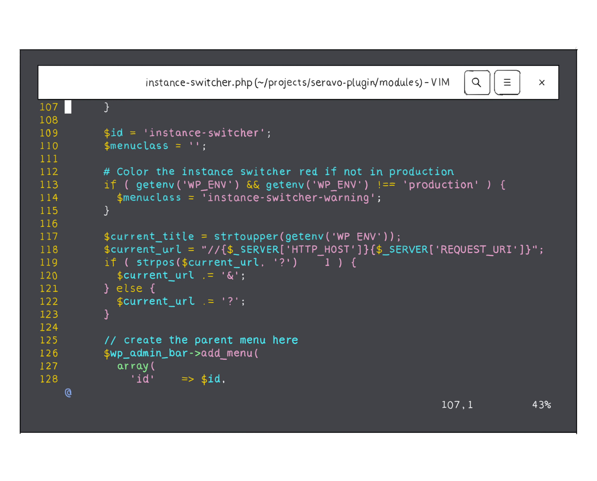
*A screenshot of the Vim editor, showcasing its simple and efficient command-line interface.*

#### General-purpose editors

Today's coding landscape sees many developers gravitating towards editors that seamlessly integrate mouse navigation, offering a more intuitive and enriched user experience. Among these, Visual Studio Code, or VS Code for short, stands out. Launched by Microsoft in 2015, it rapidly gained traction due to its rich feature set, versatility, and a vast library of extensions. VS Code blended the efficiency of traditional editors with the visual appeal and mouse integration that many contemporary developers appreciate. The open-source nature of VS Code also allowed a community of developers to contribute, enhancing its capabilities even further.

Another example in this category is Sublime Text. These editors are like the multi-functional Swiss army knives of the coding world. Whether you're coding a website, an app, scripting something fun, or working in multiple programming languages, these editors are ready to assist. They offer features such as code coloring, a.k.a. syntax highlighting, auto-completion, error detection, the ability to add extra features through plugins, and integration of a mini command line known as an integrated terminal.

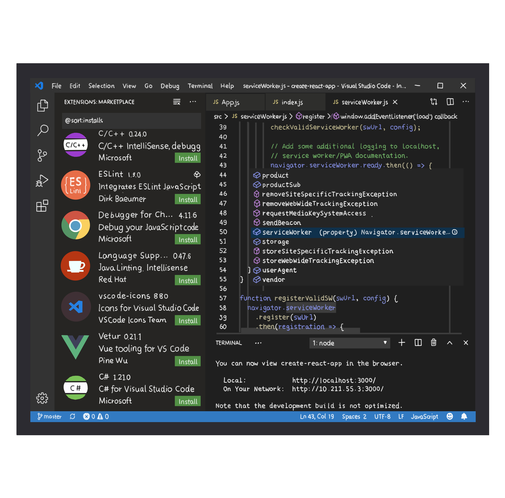
*A user interface snapshot of the Visual Studio Code (VS Code) editor, illustrating its modern and intuitive design.*

#### Integrated Development Environments (IDEs)

When delving deep into a coding project, sometimes a simple text editor won't suffice. IDEs offer more comprehensive features compared to basic text editors, integrating numerous tools essential for software development. While every IDE includes a code editor, not every code editor qualifies as an IDE.

Popular IDEs include Visual Studio for multiple languages (but primarily C#), Eclipse and IntelliJ for Java, PyCharm for Python, Android Studio for Android app development, and Apple's Xcode for iOS app development. These environments are specially designed for a deeper integration with specific languages or development tasks. They provide tools that simplify the entire software development process - from writing code, to testing, debugging, and even deploying.

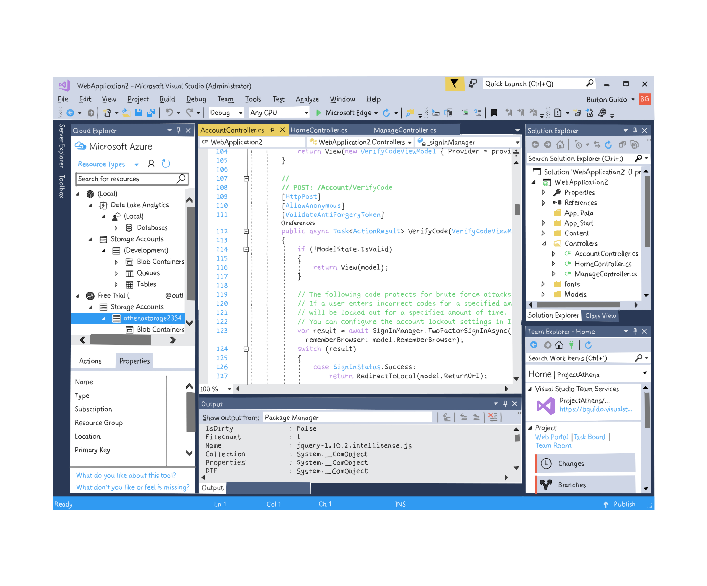
*The interface of the Visual Studio Integrated Development Environment (IDE), highlighting its array of integrated tools for software development.*

### The conclusion

The world of code editors spans a broad spectrum. On one end, you have minimalist tools like Vim that operate solely on keyboard commands, and on the other end, there are IDEs like Visual Studio that bring together a suite of tools.

Today, however, VS Code represents a harmonious middle ground. It stands as a testament to the evolution of code editors, seamlessly blending the efficiency of traditional editors with the intuitive interfaces of modern-day tools.


*A bar chart from a Stack Overflow survey conducted in 2023, displaying preferences for different code editors among developers. [Source](https://survey.stackoverflow.co/2023/#integrated-development-environment)*

For those embarking on their coding journey, I can't recommend VS Code enough. It's versatile and caters to a multitude of projects. While there may be instances where a specialized tool is beneficial, VS Code fulfills the requirements of the majority of programmers.

[Download VS Code here](https://code.visualstudio.com/), and happy programming!
